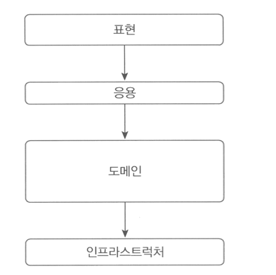
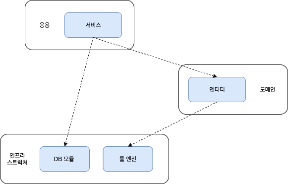
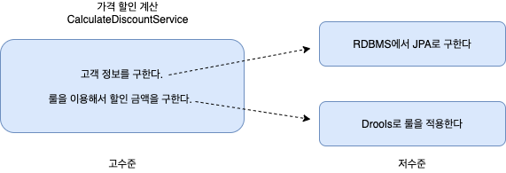
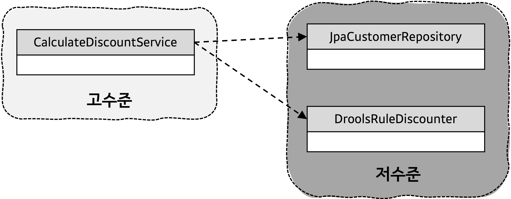
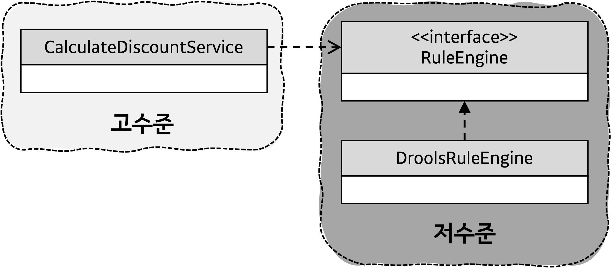
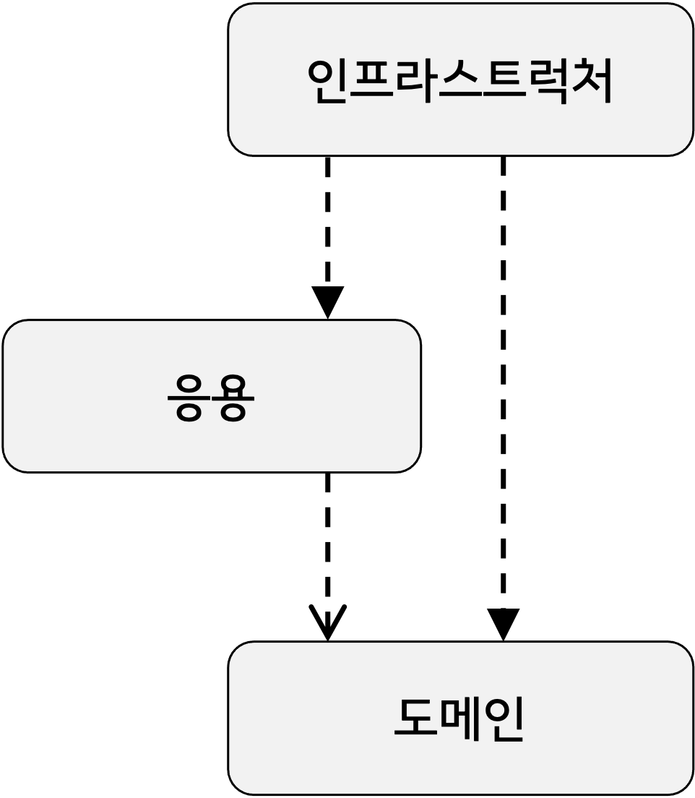
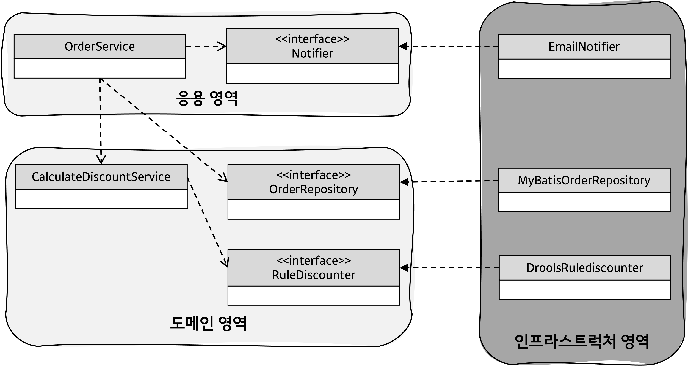
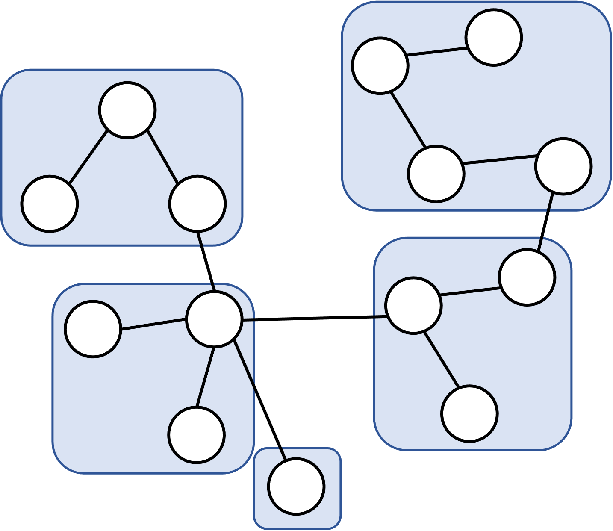
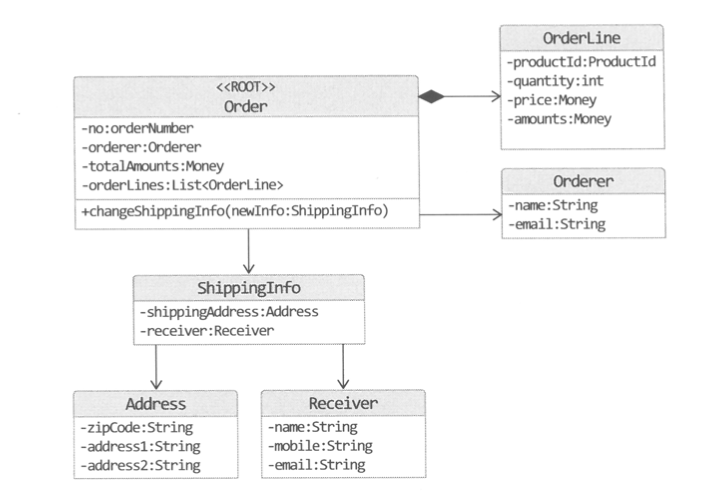
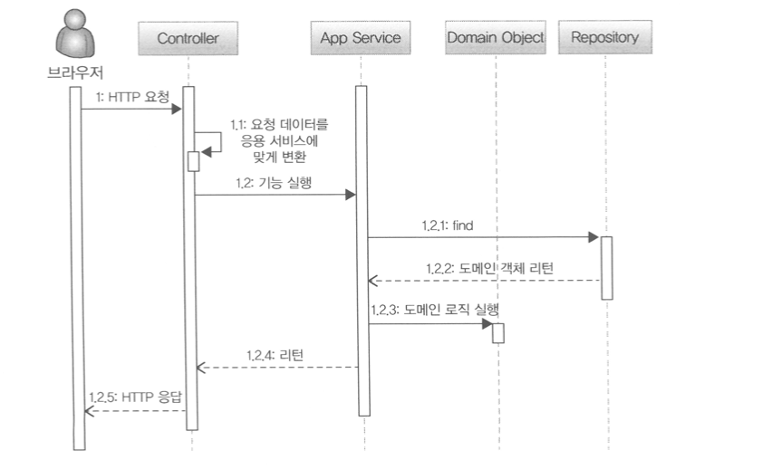

# 02. 아키텍처 개요

## 네 개의 영역

### 표현 영역


- 요청을 받아 응용 영역에 전달하고, 응용 영역의 처리 결과를 사용자가 이해할 수 있는 형식으로 변환하여 응답한다
- 스프링 MVC 프레임워크가 표현 영역을 위한 기술에 해당한다
- 웹 어플리케이션의 표현 영역은 HTTP 요청을 응용 영역이 필요로 하는 형식으로 변환해서 응용 영역에 전달하고 응용 영역의 응답을 HTTP 응답으로 변환하여 전송한다

### 응용 영역


- 시스템이 사용자에게 제공해야 할 기능을 구현한다
- 기능을 구현하기 위해 도메인 영역의 도메인 모델을 사용한다
- 응용 서비스는 로직을 직접 수행하기보다는, **도메인 모델에 로직 수행을 위임한다**
    - ex. 주문 취소 로직을 직접 구현하지 않고 Order 객체에 취소 처리를 위임한다
        
        ```java
        public class CancelOrderService {
        	@Transactional
        	public void cancelOrder(String orderId) {
        		Order order = findOrderById(orderId);
        		if (order == null) throw new OrderNotFoundException(orderId);
        		order.cancel();
        	}
        }
        ```
        

### 도메인 영역

- 도메인 모델을 구현한다
- 도메인 모델은 도메인의 핵심 로직을 구현한다

### 인프라스트럭쳐 영역


- 논리적 개념을 표현하기 보다는 **실제 구현 기술**에 대한 것을 다룬다
    - RDBMS 연동
    - 메시징 큐에 메시지 전송/수신
    - 몽고 DB나 레디스의 데이터 연동
    - SMTP를 이용한 메일 발송
    - HTTP 클라이언트를 이용한 REST API 호출
- 도메인 영역, 응용 영역, 표현 영역은 구현 기술을 사용한 코드를 직접 만들지 않으며, 대신 인프라스트럭쳐 영역에서 제공하는 기능을 사용해서 필요한 기능을 개발한다
    - ex. 응용 영역에서 DB에 보관된 데이터가 필요하면 인프라스터럭처 영역의 DB모듈을 사용하여 데이터를 읽어온다

## 계층 구조 아키텍처



- 위 그림은 계층 구조의 아키텍처 구성이다
    - (도메인의 복잡도에 따라 응용과 도메인을 분리하기도 하고 한 계층으로 합치기도 한다)

### 계층 구조의 의존 방향

- 상위 계층에서 하위 계층으로의 의존만 존재한다
    - [응용→도메인]은 있으나 [도메인→응용]은 없다
- 엄격하게 바로 아래의 계층에만 의존하게 할 수도 있지만, 구현의 편리함을 위해 계층 구조를 더 아래 계층을 의존하게 할 수도 있다
    - 엄격하게 [응용 → 도메인 → 인프라스트럭처]만 하게 할수도 있지만, 편리함을 위해 [응용 → 인프라스트럭처]할 수 있다
        
        
        
- **결국, 표현/응용/도메인 계층은 최종적으로 인프라스트럭처 계층에 종속된다**

### 인프라스트럭처 계층에 종속되는 표현/응용/도메인 계층

- 인프라스트럭처 영역은 상세한 구현 기술을 다룬다
- 만약, 할인 금액을 계산하기 위해 Drools라는 룰 엔진을 사용한다면..
    - 인프라스트럭처 영역의 ‘`DroolsRuleEngine`’ (내부 구현은 아무것도 중요하지 않다)
        
        ```java
        public class DroolsRuleEngine {
        
            private KieContainer kieContainer;
        
            public DroolsRuleEngine() {
                this.kieContainer = KieServices.Factory.get().getKieClasspathContainer();
            }
        
            public void evaluate(String sessionName, List<?> facts) {
                KieSession kieSession = kieContainer.newKieSession(sessionName);
                try {
                    facts.forEach(x -> kieSession.insert(x));
                    kieSession.fireAllRules();
                } finally {
                    kieSession.dispose();
                }
            }
        }
        ```
        
    - 응용 영역의 ‘`CalculateDiscountService`’
        
        ```java
        public class CalculateDiscountService {
            private DroolsRuleEngine ruleEngine;
        
            CaculateDiscountService() {
                ruleEngine = new DroolsRuleEngine();
            }
        
            public Money calculateDiscount(List<OrderLine> orderLines, String customerId) {
                Customer customer = findCustomer(customerId);
        
                MutableMoney money = new MutableMoney(0);
                List<Object> facts = Arrays.asList(customer, money);
                facts.addAll(orderLines);
                ruleEngine.evaluate("discountCalculation", facts);
                return money.toImmutableMoney();
            }
        }
        ```
        
    - 응용 영역의 ‘`CalculateDiscountService`’가 인프라스트럭처 영역의 ‘`DroolsRuleEngine`’를 의존한다

### 인프라스트럭처 영역을 의존함으로써 생기는 단점

1. 응용 영역만 테스트하기 어렵다
2. 구현 방식을 변경하기 어렵다
    - 특정 구현 기술에 특화된 코드가 응용 영역에 들어간다

## DIP

### 고수준 모듈과 저수준 모듈

- 고수준 모듈은 의미있는 단일 기능을 제공하는 모듈이다
- 그리고 고수준 모둘의 기능을 구현하려면 여러 하위 기능이 필요한데, 이 하위 기능을 실제로 구현하는 것이 저수준 모듈이다
    - ‘가격 할인 계산 기능’을 구현하기 위해서는 ‘고객 정보 구하는’ 작업과 ‘룰을 실행하는’ 작업이 필요한데, 따라서 ‘가격 할인 계산 기능’가 고수준 모듈의 기능이며, ‘고객 정보 구하는’ 작업과 ‘룰을 실행하는’ 작업이 저수준 모듈의 기능이다
        
        
        
- 결국 고수준 모듈이 저수준 모듈을 사용하는 그림이 그려지는데, 이는 구현 변경과 테스트가 어렵다는 문제를 낳는다

### 의존의 역전

- 고수준 모듈이 저수준 모듈을 사용해야 하지만, 의존은 **저수준 모듈이 고수준 모듈에 의존하도록** 바꾼다
- 이를 가능하게 하는 건 ‘인터페이스 추상화’이다
    - 고수준 모듈인 `CalculateDiscountService`는 사실 고객 정보를 JPA로 구해왔는지 jdbc로 구해왔는지, 또 룰 적용을 Drools로 구현했는지 자바로 직접 구현했는지는 중요하지 않다
    - 따라서, 고객 정보를 조회하는 기능과 룰 적용하여 계산하는 기능을 추상화를 해보면
        
        ```java
        public interface RuleDiscounter {
        	Money applyRules(Customer customer, List<OrderLine> orderLines);
        }
        ```
        
        ```java
        public interface CustomerRepsitory {
        	Customer findById(String id);
        }
        ```
        
    - 결국, 고수준 모듈 `CalculateDiscountService`는 추상화된 인터페이스를 이용하게 된다
        
        ```java
        public class CalculateDiscountService {
            private RuleDiscounter ruleDiscounter;
        		private CustomerRepsitory customerRepsitory;
        
            public CalculateDiscountService(RuleDiscounter ruleDiscounter, CustomerRepsitory customerRepsitory) {
                this.ruleDiscounter = ruleDiscounter;
                this.customerRepsitory = customerRepsitory;
            }
        
            public Money calculateDiscount(List<OrderLine> orderLines, String customerId) {
                Customer customer = customerRepsitory.findById(customerId);
                return ruleDiscounter.applyRules(customer, orderLines);
            }
        }
        ```
        
        ```java
        RuleDiscounter ruleDiscounter = new DroolsRuleDiscounter();
        CustomerRepsitory customerRepsitory = new JpaCustomerRepsitory(...);
        
        CalculateDiscountService disService = new CalculateDiscountService(ruleDiscounter, customerRepsitory);
        ```
        
    - 구현 기술을 변경하고 싶으면 저수준 구현 객체를 생성하는 코드만 변경한다
        
        ```java
        RuleDiscounter ruleDiscounter = new SimpleRuleDiscounter();
        CustomerRepsitory customerRepsitory = new JdbcCustomerRepsitory(...);
        
        CalculateDiscountService disService = new CalculateDiscountService(ruleDiscounter, customerRepsitory);
        ```
        

**DIP 적용 전과 후**

- DIP 적용 전
    
    
    
- DIP 적용 후
    - **고수준 모듈이 저수준 모듈을 사용하지만, 의존성의 방향은 저수준 모듈이 고수준 모듈을 의존하고 있다**
        
        
        

**DIP를 적용한 효과**

1. 구현 기술을 변경하더라도 고수준 모듈은 수정할 필요가 없다

     
    
2. 테스트하기 쉽다
    - 이전에는 `CalculateDiscountService`를 테스트하기 위해 실제로 구현되어있는 저수준 모듈이 필요했지만, 이제는 쉽게 대역 객체를 사용해서 테스트를 진행할 수 있다
        
        ```java
        public class CalculateDiscountServiceTest {
        	@Test
        	public void 고객정보가_없으면_NoCustomerException이_발생한다() {
        		CustomerRepository stubRepo = mock(CustomerRepository.class);
        		when(stubRepo.findById("noCustId")).thenReturn(null);
        		RuleDiscounter stubRule = (cust, lines) -> null;
        
        		CalculateDiscountService calDisService = new CalculateDiscountService(stubRepo, stubRule);
        
        		assertThrows(NoCustomerException.class, () -> calDisService.calculateDiscount(someLines, "noCustId"));
        	}
        }
        ```
        
    - 실제 구현 클래스가 없어도 스텁이나 메스트 목적의 대역을 사용하여 테스트할 수 있다

### DIP의 그릇된 이해

- DIP를 단순하게 ‘인터페이스와 구현 클래스의 분리’로 **잘못** 이해하는 경우도 있다
- DIP의 핵심은 고수준 모듈이 저수준 모듈에 의존하지 않게 하기 위함이다
- DIP의 결과 구조만 보고, 저수준 모듈에서 인터페이스를 추출하는 경우도 있는데, 이는 DIP가 아니다
    
    
    
    - DroolsRuleEngine으로부터 인터페이스를 추출하여 RuleEngine을 만들었다
    - 이는 사실상 저수준 모듈이다
        
        
        
- **DIP를 적용할 때, 하위 기능의 추상화 인터페이스는 고수준 모듈 관점에서 도출해야 한다**

### 아키텍처와 DIP 구조

- 인프라스트럭처 영역은 구현 기술을 다루는 저수준 모듈이고, 응용 영역과 도메인 영역은 고수준 모듈이다
- 따라서 인프라스트럭처 계층이 가장 하단에 있는 계층형 구조와는 다르게, 아키텍처에 DIP를 적용하면 **인프라스트럭처 영역이 응용 영역과 도메인 영역에 의존하는 구조가 된다**
    
    
    



### DIP 이점 따져보기

- DIP를 항상 적용할 필요는 없다
- 사용하는 기현 기술에 따라 완벽한 DIP를 적용하기보다는 구현 기술에 의존적인 코드를 도메인에 일부 포함하는게 효과적일 때가 있다
- 또는 추상화 대상이 잘 떠오르지 않을 수도 있다
- 이럴 때는 무조건 DIP를 적용하려 시도하지 말자
- DIP의 이점을 얻는 수준에 적용 범위를 검토하자

## 도메인 영역의 주요 구성요소

| 엔티티 | - 도메인의 고유한 개념을 표현한다
- 도메인 모델의 데이터를 포함하며 해당 데이터와 관련된 기능을 함께 제공한다
- 자신의 라이프라이클을 갖는다 |
| --- | --- |
| 밸류 | - 개념적으로 하나인 값을 표현한다
- 엔티티의 속성으로 사용되기도 하고 다른 밸류 타입의 속성으로도 사용된다 |
| 애그리거트 | - 연관된 엔티티와 밸류 객체를 개념적으로 하나로 묶은 것이다 |
| 리포지터리 | - 도메인 모델의 영속성을 처리한다
- 엔티티 객체를 로딩하거나 저장한다 |
| 도메인서비스 | - 특정 엔티티에 속하지 않은 도메인 로직을 제공한다
- 도메인 로직이 여러 엔티티와 밸류를 필요로 하면 도메인 서비스에서 로직을 구현한다 |

### 엔티티와 밸류

- ‘도메인 모델’의 엔티티와 ‘DB 관계형 모델’의 엔티티는 서로 다르다
- ‘도메인 모델'의 엔티티는 데이터와 함께 도메인 기능을 함께 제공한다
    - ‘도메인 모델’의 엔티티는 단순히 데이터를 담고 있는 데이터 구조가 아니다
    - 도메인 관점에서 기능을 구현하고 기능 구현을 캡슐화하여 데이터가 임의로 변경되는 것을 막는다
- ‘도메인 모델'의 엔티티는 두 개 이상의 데이터가 개념적으로 하나인 경우, 밸류 타입을 이용하여 표현할 수 있다
    - 관계형 데이터베이스는 밸류 타입을 제대로 표현하기 힘들다
    - ‘주문’에 ‘주문자’라는 개념을 표현한다고 했을 때, 주문 테이블에 주문자 정보를 함께 넣게되면 ‘주문자'라는 개념이 드러나지 않으며, 주문자 테이블을 별도의 테이블로 분리한다 할지라도 테이블 엔티티에 가깝지 밸류 타입의 의미로는 전혀 드러나지 않는다

### 애그리거트

- 엔티티와 밸류 개수가 많아지면 모델은 점점 복잡해진다
    
    
    
- 도메인 모델이 복잡해지면 상위 수준에서 모델을 관리하지 못하고 각 개별 요소에 초점을 맞추는 현상이 발생하는데, 큰 수준에서 모델을 이해하지 못해 큰 틀에서 모델을 관리할 수 없는 상황에 빠진다
- 관련된 객체를 애그리거트로 묶으면 복잡한 도메인 모델을 관리하는데 도움을 준다
    
    
    

**애그리거트의 이점**

- 애그리거트를 사용하면 객체 군집 단위로 모델을 바라볼 수 있게 된다
- 개별 객체 간의 관계가 아닌 애그리거트 간의 관계로 도메인 모델을 이해하고 구현하게 된다
- 큰 틀에서 도메인 모델을 관리할 수 있게 되는 것이다

**애그리거트 루트**

- 애그리거트는 **루트 엔티티**를 갖는다
- 이 루트 엔티티는 애그리거트가 구현해야 할 기능을 애그리거트에 속해있는 여러 엔티티와 밸류 객체를 이용하여 제공한다
- 이 애그리거트를 사용하는 코드는, 애그리거트 루트가 제공하는 기능을 실행하여 애그리거트 내의 다른 엔티티나 밸류에 **간접적으로** 접근한다
- 애그리거트 단위로 캡술화가 되는 것이다



- 애그리거트 루트인 `Order`가 애그리거트에 속한 객체들을 관리한다
    - 주문 애그리거트는 `Order`를 통하지 않고서는 배송지를 변경할 수 없으며, 배송지를 변경하려면 루트 앤티티인 `Order`를 사용해야 한다
    - 결국 `Order`가 구현한 도메인 로직을 항상 따르게 된다

### 리포지터리

- 도메인 객체를 지속적으로 사용하려면 물리적인 저장소에 도메인 객체를 보관해야 한다
- 이를 위한 도메인 모델이 바로 ‘리포지터리’이다
- 엔티니와 밸류가 요구사항에서 도출되는 도메인 모델이라면, 리포지터리는 구현을 위한 도메인 모델이다

**고수준 모듈인 리포지터리**

```java
public interface OrderRepository {
	Order findByNumber(OrderNumber number);
	void save(Order order);
	void delete(Order order);
}
```

- `OrderRepository`는 대상을 찾고 저장하는 단위가 애그리거트 루트인 `Order`이다
- `Order`는 애그리거트에 속한 모든 객체를 포함하고 있으므로 결과적으로 애그리거트 단위로 저장하고 조회한다
- 도메인 모델 관점에서 `OrderRepository`는 도메인 객체를 영속화하는데 필요한 기능을 추상화한 것으로 **고수준 모듈에 해당한다**
- 기반 기술을 이용해서 `OrderRepository` 를 구현한 클래스는 저수준 모듈로 인프라스트럭처 영역에 속하게 된다
    
    
    

## 요청 처리 흐름



1. 사용자가 애플리케이션에 기능 실행을 요청하면 그 요청을 처음 받는 영역은 **표현 영역**이다
    - 스프링 MVC를 사용해서 웹 어플리케이션을 구현했다면 컨트롤러가 사용자의 요청을 받아 처리하게 된다
2. 표현 영역은 사용자가 전송한 데이터 형식이 올바른지 검사하고 문제가 없다면 응용 서비스에 기능 실행을 위임한다
    - 이 때, 사용자가 전송한 데이터를 응용서비스가 요구하는 형식으로 변환해서 전달한다
3. 응용 서비스는 도메인 모델을 이용해서 기능을 구현한다
    - 기능 구현에 필요한 도메인 객체를 리포지터리에서 가져와 실행하거나 신규 도메인 객체를 생성해서 리포지터리에 저장한다
    - 응용 서비스는 도메인의 상태를 변경하므로 변경상태가 물리 저장소에 올바르게 반영되도록 **트랜잭션을 관리한다**
    - 스프링 프레임워크를 사용한다면 @Transactional 애너테이션을 사용하여 트랜잭션을 처리할 수 있다

## 인프라스트럭처 개요

- 인프라스트럭처는 표현 영역, 응용 영역, 도메인 영역을 지원한다
    - 영속성 처리, 트랜잭션, SMTP 클라이언트, REST 클라이언트 등 다른 영역에서 필요로 하는 프레임워크, 구현 기술, 보조 기능을 지원한다
- 도메인 영역과 응용 영역에서 인프라스트럭처의 기능을 직접 사용하는 것보다 이 두 영역에서 정의한 인터페이스를 인프라스트럭처 영역에서 구현하는 것이 시스템을 더 유연하고 테스트하기 쉽게 만들어준다
- **하지만 구현의 편리함은 DIP가 주는 장점만큼 중요하다**
    - **무조건 인프라스트럭처에 대한 의존을 없앨 필요는 없다**
    - DIP의 장점을 해치지 않는 범위에서, 응용 영역과 도메인 영역에서 구현 기술에 대한 의존을 가져가는 것도 나쁘지 않다
        - 응용 서비스는 트랜잭션 처리를 위해 스프링이 제공하는 @Transactional을 사용하는 것이 편리하다
        - 영속성 처리를 위해 JPA를 사용한다면 @Entity나 @Table과 같은 JPA 전용 애너테이션을 도메인 모델 클래스에 사용하는 것이 XML 매핑 설정을 이용하는 것보다 편리하다
    - 응용 영역과 도메인 영역이 인프라스트럭처에 대한 의존을 완전히 갖지 않도록 하는 것은 **자칫 구현을 더 복잡하고 어렵게 만든다**

## 모듈 구성

- 패키지 구성 규칙에 정답이 있진 않지만, 아래처럼 영역별로 모듈이 위치할 패키지를 구성할 수 있다
    
    
    
- 만약 도메인이 크다면 하위 도메인으로 나누고 각 하위 도메인마다 별도 패키지를 구성할 수 있다

    
    
- 도메인 모듈은 도메인이 속한 애그리거트를 기준으로 다시 패키지를 구성하는데, 만약 하위 도메인이 구성되게 된다면 하위 패키지로 구성할 수 있다

    
    
- 애그리거트, 모델, 리포지터리는 같은 패키지에 위치시키면 되는데 만약 도메인이 복잡하다면 도메인 모델과 도메인 서비스를 별도 패키지에 위치시킬 수 있다
    - `com.myshop.order.domain.order` : 애그리거트
    - `com.myshop.order.domain.service` : 도메인 서비스
- 비슷하게 응용 서비스도 도메인별로 패키지를 구분할 수 있다
    - `com.myshop.order.application.product`
    - `com.myshop.order.application.category`
- 모듈 구조를 얼마나 세분화할지 정해진 규칙은 없다
- 한 패키지에 너무 많은 타입이 몰려 불편할 정도만 아니면 된다