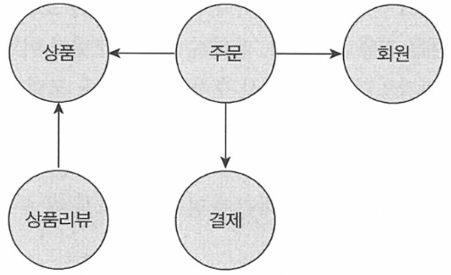

# Chapter 3. 애그리거트

## 애그리거트

---

- 상위 수준 개념을 이용해서 전체 모델을 정리하면 전반적인 관계를 이해하는 데 도움이 된다.
    
    
    
    3.1 상위 수준에서 모델을 정리하면 복잡한 도메인 모델의 관계를 이해하는 데 도움이 된다.
    
    
    
    3.2 개별 객체 수준에서 모델을 바라보면 상위 수준에서 관계를 파악하기 어렵다
    

- 주요 도메인 개념 간의 관계를 파악하기 어렵다는 것은 곧 코드를 변경하고 확장하는 것이 어려워진다는 것을 의미한다.
    - 상위 수준에서 모델이 어떻게 엮여 있는지 알아야 전체 모델을 망가뜨리지 않으면서 추가 요구사항을 모델에 반영할 수 있는데
    - 세부적인 모델만 이해한 상태로는 코드를 수정하기가 두렵기 때문에 코드 변경을 최대한 회피하는 쪽으로 요구사항을 협의하게 된다.
- 애그리거트: 복잡한 도메인을 이해하고 관리하기 쉬운 단위로 만들려면 상위 수준에서 모델을 조망할 수 있는 방법
    - 수많은 객체를 애그리거트로 묶어서 바라보면 좀 더 상위 수준에서 도메인 모델 간의 관계를 파악할 수 있다.
        
        
        
        3.3 애그리거트는 복잡한 모델을 관리하는 기준을 제공한다.
        
- 애그리거트는
    - 모델을 이해하는 데 도움을 줄 뿐만 아니라 일관성을 관리하는 기준이 된다.
    - 복잡한 도메인을 단순한 구조로 만들어준다.
        - 복잡도가 낮아지는 만큼 도메인 기능을 확장하고 변경하는 데 필요한 노력(개발 시간)도 줄어든다.
    - 관련된 모델을 하나로 모은 것이기 때문에 한 애그리거트에 속한 객체는 유사하거나 동일한 라이프사이클을 갖는다.
    - 한 애그리거트에 속한 객체는 다른 애그리거트에 속하지 않는다.
        - 애그리거트는 독립된 객체 군이며, 각 애그리거트는 자기 자신을 관리할 뿐 다른 애그리거트를 관리하지 않는다.
    - 경계를 설정할 때 기본이 되는 것은 도메인 규칙과 요구사항이다.
        - 도메인 규칙에 따라 함께 생성되는 구성요소는 한 애그리거트에 속할 가능성이 높다.
        - 함께 변경되는 빈도가 높은 객체는 한 애그리거트에 속할 가능성이 높다.
    - 'A가 B를 갖는다'로 해석할 수 있는 요구사항이 있다고 하더라도 이것이 반드시 A와 B가 한 애그리거트에 속한다는 것을 의미하는 것은 아니다.
        - 좋은 예) 상품과 리뷰
            - 상품 상세 페이지에 들어가면 상품 상세 정보와 함께 리뷰 내용을 보여줘야 한다는 요구사항이 있다면 Product 엔티티와 Review 엔티티가 한 애그리거트에 속한다고 생각할 수 있다.
            - 하지만, Product와 Review는 함께 생성되지 않고 함께 변경되지도 않는다.
            - 게다가 Product를 변경하는 주체가 상품 담당자라면 Review를 생성하고 변경하는 주체는 고객이다.
            
            
            
            3.4 Product가 Review를 갖는 것으로 생각할 수 있다. 하지만, 상품과 리뷰는 함께 생성되거나 변경되지 않고 변경 주체도 다르기 때문에 서로 다른 애그리거트에 속한다.
            

- 처음 도메인 모델을 만들기 시작하면 큰 애그리거트로 보이는 것들이 많지만 도메인에 대한 경험이 생기고 도메인 규칙을 제대로 이해할수록 실제 애그리거트의 크기는 줄어들게 된다.****
    - 그 동안 경험을 비추어 보면 다수의 애그리거트가 한 개의 엔티티 객체만 갖는 경우가 많으며
    - 두 개 이상의 엔티티로 구성되는 애그리거트는 드물게 존재한다.

## 애그리거트 루트

---

- 애그리거트는 여러 객체로 구성되기 때문에 한 객체만 상태가 정상이어서는 안 된다.
    - 도메인 규칙을 지키려면 애그리거트에 속한 모든 객체가 정상 상태를 가져야 한다.
- 애그리거트에 속한 모든 객체가 일관된 상태를 유지하려면 애그리거트 전체를 관리할 주체가 필요한데
    - 이 책임을 지는 것이 바로 애그리거트의 루트 엔티티
        
        
        
        3.5 주문 애그리거트의 루트는 Order이다.
        

### 도메인 규칙과 일관성

---

- 애그리거트 루트의 핵심 역할은 애그리거트의 일관성이 깨지지 않도록 하는 것
    - 이를 위해 애그리거트 루트는 애그리거트가 제공해야 할 도메인 기능을 구현한다.
        - 주문 애그리거트는 배송지 변경, 상품 변경과 같은 기능을 제공하는데 애그리거트 루트인 Order가 이 기능을 구현한 매서드를 제공한다.
    - 애그리거트 루트가 제공하는 메서드는 도메인 규칙에 따라 애그리거트에 속한 객체의 일관성이 깨지지 않도록 구현해야 한다.
        - 배송이 시작되기 전까지만 배송지 정보를 변경할 수 있다는 규칙이 있다면, 애그리거트 루트인 Order의 changeShippingInfo() 메서드는 이 규칙에 따라 배송 시작 여부를 확인하고 변경이 가능한 경우에만 배송지 정보를 변경해야 한다.
            
            ```java
            public class Order {
            
                // 애그리거트 루트는 도메인 규칙을 구현한 기능을 제공한다.
                public void changeShippingInfo(ShippingInfo newShippingInfo) {
                    verifyNotYetShipped();
                    setShippingInfo(newShippingInfo);
                }
            
                private void verifyNotYetShipped() {
                    if (state != OrderState.PAYMENT_WAITING && state != OrderState.PREPARING)
                        throw new IllegalStateException("already shipped");
                }
            }
            ```
            
    - 애그리거트 루트가 아닌 다른 객체가 애그리거트에 속한 객체를 직접 변경하면 안된다. 이는 애그리거트 루트가 강제하는 규칙을 적용할 수 없어 모델의 일관성을 깨는 원인이 된다.
        
        ```java
        ShippingInfo si = order.getShippingInfo();
        si.setAddress(newAddress);
        ```
        
        - 주문 상태에 상관없이 배송지 주소를 변경할 수 있는데, 이는 업무 규칙을 무시하고 DB 테이블에서 직접 데이터를 수정하는 것과 같은 결과를 만든다.
            
            😵 논리적인 데이터 일관성이 깨지게 되는 것
            
        - 일관성을 지키기 위해 상태 확인 로직을 응용 서비스에 구현할 수도 있지만,
            - 동일한 검사 로직을 여러 응용 서비스에서 중복해서 구현할 가능성이 높아져 상황을 더 악화시킬 수 있다.
            
            ```java
            ShippingInfo si = order.getShippingInfo();
            
            // 주요 도메인 로직이 중복되는 문제
            if (state != OrderState.PATMENT_WATTING && state != OderState.WATTING) {
                throw IllegalArguementException();
            }
            shippingInfo.setAddress(newAddress);
            ```
            

- 불필요한 중복을 피하고 애그리거트 루트를 통해서만 도메인 로직을 구현하게 만들려면 도메인 모델에 대해 다음의 두 가지를 습관적으로 적용해야 한다.
    - 단순히 필드를 변경하는 `set` 메서드를 공개(`public`) 범위로 만들지 않는다.
        
        ```java
        // 도메인 모델에서 공개 set 메서드는 가급적 피해야 한다.
        public void setName(String name) {
            this.name = name;
        }
        ```
        
        - 공개 `set` 메서드는 중요 도메인의 의미나 의도를 표현하지 못하고 도메인 로직이 도메인 객체가 아닌 응용 영역이나 표현 영역으로 분산되게 만드는 원인이 된다.
    - 밸류 타입은 불변으로 구현한다.
        - 밸류 객체의 값을 변경할 수 없으면 애그리거트 루트에서 밸류 객체를 구해도 값을 변경할 수 없기 때문에 애그리거트 외부에서 밸류 객체의 상태를 변경할 수 없게 된다.
            
            ```java
            ShippingInfo si = order.getShippingInfo();
            si.setAddress(newAddress); // ShippingInfo 밸류 객체가 불변이면, 이 코드는 컴파일 에러!
            ```
            
        - 밸류 객체가 불변이면 밸류 객체의 값을 변경하는 방법은 새로운 밸류 객체를 할당하는 것뿐****
            - 애그리거트 루트가 제공하는 메서드에 새로운 밸류 객체를 전달해서 값을 변경하는 방법밖에 없다.
                
                ```java
                public class Order {
                    private ShippingInfo shippingInfo;
                    public void changeShippingInfo(ShippingInfo newShippingInfo) {
                        verifyNotYetShipped();
                        setShippingInfo(newShippingInfo);
                    }
                    // set 메서드의 접근 허용 범위는 private이다.
                    private void setShippingInfo(ShippingInfo shippingInfo) {
                        // 밸류가 불변이면, 새로운 객체를 할당해서 값을 변경해야 한다.
                        // 불변이므로 this.shippingInfo.setAddress(newShippingInfo.getAddress())와 같은 코드를 사용할 수 없다.
                        this.shippingInfo = shippingInfo;
                    }
                }
                ```
                
        - 밸류 타입의 내부 상태를 변경하려면 애그리거트 루트를 통해서만 가능하다.

### 애그리거트 루트의 기능 구현

---

- 애그리거트 루트는
    - 애그리거트 내부의 다른 객체를 조합해서 기능을 완성한다.
        - Order는 총 주문 금액을 구하기 위해 OrderLine 목록을 사용한다.
            
            ```java
            public class Order{
                private Money totalAmounts;
                private List<OrderLine> orderLines;
            
                private void calculateTotalAmounts() {
                    int sum = orderLines.stream()
                                .mapToInt(ol -> ol.getPrice() * ol.quantitiy()).sum();
                    this.totalAmounts = new Money(sum);
                }
            }
            ```
            
    - 기능 실행을 위임하기도 한다.
        - OrderLine 목록을 별도 클래스로 분리했다.
            
            ```java
            //별도의 클래스로 분리
            public class OrderLines {
                private List<OrderLine> lines;
            
                public int getTotalAmounts() {...}
                public void changeOrderLines(List<OrderLine> newLines) {
                    this.lines = newLines;
                }
            }
            ```
            
            - Order의 changeOrderLines() 메서드는 다음과 같이 내부의 orderLines 필드에 상태 변경을 위임하는 방식으로 기능을 구현했다.
                
                ```java
                public class Order {
                    private OrderLines orderLines;
                
                    public void changeOrderLines(List<OrderLine> newLines) {
                        orderLines.changeOrderLines(newLines);
                        this.totalAmounts = orderLines.getTotalAmounts();
                    }
                }
                ```
                

### 트랜잭션 범위

---

- 트랜잭션 범위는 작을수록 좋다.
- 세 개의 테이블을 수정하면 잠금 대상이 더 많아진다.
    - 잠금 대상이 많아진다는 것은 그만큼 동시에 처리할 수 있는 트랜잭션 개수가 줄어든다는 것을 뜻하고
    - 이는 전체적인 성능(처리량)을 떨어뜨린다.

- 동일하게 한 트랜잭션에서는 한 개의 애그리거트만 수정해야 한다.
    - 한 트랜잭션에서 두 개 이상의 애그리거트를 수정하면 트랜잭션 충돌이 발생할 가능성이 더 높아지기 때문에
    - 한번에 수정하는 애그리거트 개수가 많아질수록 전체 처리량이 떨어지게 된다.

- 만약 부득이하게 한 트랜잭션으로 두 개 이상의 애그리거트를 수정해야 한다면 응용 서비스에서 두 애그리거트를 수정하도록 구현해야 한다.
    
    ```java
    public class ChangeOrderService {
        // 두 개 이상의 애그리거트를 변경해야 하면,
        // 응용 서비스에서 각 애그리거트의 상태를 변경한다.
        @Transactional
        public void changeShippingInfo(OrderId id, 
                                       ShippingInfo newShippingInfo, 
                                       boolean useNewShippingAddrAsMemberAddr) {
            Order order = orderRepository.findbyId(id);
            if (order == null) throw new OrderNotFoundException();
            order.shipTo(newShippingInfo);
            if (useNewshippingAddrAsMemberAddr) {
                order.getOrderer()
                    .getCustomer().changeAddress(newShippingInfo.getAddress());
            }
        }
        ...
    }
    ```
    
- 도메인 이벤트를 사용하면 한 트랜잭션에서 한 개의 애그리거트를 수정하면서도 동기나 비동기로 다른 애그리거트의 상태를 변경하는 코드를 작성할 수 있는데, 이에 대한 내용은 10장에서 살펴볼 예정

- 한 트랜잭션에서 한 개의 애그리거트를 변경하는 것을 권장하지만 다음의 경우에는 한 트랜잭션에서 두 개 이상의 애그리거트를 변경하는 것을 고려할 수 있다.
    - 팀 표준: 팀이나 조직의 표준에 따라 사용자 유스케이스와 관련된 응용 서비스의 기능을 한 트랜잭션으로 실행해야 하는 경우가 있다. DB가 다른 경우 글로벌 트랜잭션을 반드시 사용하도록 규칙을 정하는 곳도 있다.
    - 기술 제약: 한 트랜잭션에서 두 개 이상의 애그리거트를 수정하는 대신 도메인 이벤트와 비동기를 사용하는 방식을 사용하는데, 기술적으로 이벤트 방식을 도입할 수 없는 경우 한 트랜잭션에서 다수의 애그리거트를 수정해서 일관성을 처리해야 한다.
    - UI 구현의 편리: 운영자의 편리함을 위해 주문 목록 화면에서 여러 주문의 상태를 한 번에 변경하고 싶을 것이다. 이 경우 한 트랜잭션에서 여러 주문 애그리거트의 상태를 변경할 수 있을 것이다.

## 리포지터리와 애그리거트

---

- 애그리거트는 개념적으로 하나이므로 리포지터리는 애그리거트 전체를 저장소에 영속화해야 한다.****
    - 예를 들어, Order 애그리거트를 저장할 때 애그리거트 루트와 매핑되는 테이블뿐만 아니라 애그리거트에 속한 모든 구성요소를 위한 테이블에 데이터를 저장해야 한다.
        
        ```java
        // 리포지터리에 애그리거트를 저장하면 애그리거트 전체를 영속화해야 한다.
        orderRepository.save(order);
        ```
        
- 동일하게 애그리거트를 구하는 리포지터리 메서드는 완전한 애그리거트를 제공해야 한다.
    - order 애그리거트는 OrderLine, Orderer 등 모든 구성요소를 포함하고 있어야 한다.
        
        ```java
        // 리포지터리는 완전한 Order를 제공해야 한다.
        Order order = orderRepository.findById(orderId);
        
        // order가 온전한 애그리거트가 아니라면
        // 기능 실행 도중 NullPointerException과 같은 문제가 발생한다.
        order.cancel();
        ```
        

## ID를 이용한 애그리거트 참조

---

- 애그리거트 간의 참조는 필드를 통해 쉽게 구현할 수 있다.
    
    
    
    3.6 애그리거트 루트에 대한 참조
    
- JPA를 사용하면 `@ManyToOne`, `@OneToOne`과 같은 애노테이션을 이용해서 연관된 객체를 로딩하는 기능을 제공하고 있으므로 필드를 이용해서 다른 애그리거트를 쉽게 참조할 수 있다.
- 하지만 필드를 이용한 애그리거트 참조는 다음의 문제를 야기할 수 있다.
    - 편한 탐색 오용
    - 성능에 대한 고민
    - 확장 어려움

- 한 애그리거트 내부에서 다른 애그리거트 객체에 접근할 수 있으면 다른 애그리거트의 상태를 쉽게 변경할 수 있게 된다 👉 애그리거트를 직접 참조할 때 발생할 수 있는 가장 큰 문제
    - 구현의 편리함 때문에 다른 애그리거트를 수정하고자 하는 유혹에 빠지기 쉽다.
        
        ```java
        public class Order {
            private Orderer orderer;
        
            public void changeShippingInfo(ShippingInfo newShippingInfo,
                                           boolean useNewShippingAddrAsMemberAddr) {
                ...
                if(useNewShippingAddrAsMemberAddr){
                    // 한 애그리거트 내부에서 다른 애그리거트에 접근할 수 있으면,
                    // 구현이 쉬워진다는 것 때문에 다른 애그리거트의 상태를 변경하는
                    // 유혹에 빠지기 쉽다.
                    orderer.getCusotmer().changeAddress(newShippingInfo.getAddress());
                }
            }
        }
        ```
        
    - 한 애그리거트에서 다른 애그리거트의 상태를 변경하는 것은 애그리거트 간의 의존 결합도를 높여서 결과적으로 애그리거트의 변경을 어렵게 만든다.
- 두 번째 문제는 애그리거트를 직접 참조하면 성능과 관련된 여러 가지 고민을 해야 한다는 것이다.
    - JPA를 사용할 경우 참조한 객체를 지연로딩과 즉시로딩의 두 가지 방식으로 로딩할 수 있다.
- 세 번째 문제는 확장이다.
    - 초기에는 단일 서버에 단일 DBMS로 서비스를 제공하는 것이 가능하다. 문제는 사용자가 몰리기 시작하면서 발생한다.
    - 하위 도메인별로 시스템을 분리하기 시작한다. 이 과정에서 하위 도메인마다 서로 다른 DBMS를 사용할 가능성이 높아진다.
    - 이는 더 이상 다른 애그리거트 루트를 참조하기 위해 JPA와 같은 단일 기술을 사용할 수 없음을 의미한다.

- 💡이런 세 가지 문제를 완화할 때 사용할 수 있는 것 → ID를 이용해서 다른 애그리거트를 참조하는 것
    
    
    
    3.7 아이디를 이용한 간접 참조
    
    - 애그리거트의 경계를 명확히 하고 애그리거트 간 물리적인 연결을 제거하기 때문에 모델의 복잡도를 낮춰준다.
    - 또한, 애그리거트 간의 의존을 제거하므로 응집도를 높여주는 효과도 있다.
    - 구현 복잡도도 낮아진다. + 한 애그리거트에서 다른 애그리거트를 수정하는 문제를 원척적으로 방지할 수 있다.
        - 다른 애그리거트를 직접 참조하지 않으므로 애그리거트 간 참조를 지연 로딩으로 할지 즉시 로딩으로 할지 고민하지 않아도 된다.
            
            ```java
            public class ChangeOrderService {
            
                @Transactional
                public void changeShippingInfo(OrderID id, ShippingInfo newShippingInfo, 
                                               boolean useNewShippingAddrAsMemberAddr) {
                    Order order = orderRepository.findById(id);
                    if (order == null) throw new OrderNotFoundException();
                    order.changeShippingInfo(newShippingInfo);
            
                    if(useNewShippingAddrAsMemberAddr){
                        // ID를 이용해서 참조하는 애그리거트를 구한다.
                        Customer customer = customerRepository.findById(order.getOrderer().getCustomerId());
                        customer.changeAddress(newShippingInfo.getAddress());
                    }
                }
                ...
            }
            ```
            
    - 애그리거트별로 다른 구현 기술을 사용하는 것도 가능해진다.
        - 또한, 각 도메인을 별도 프로세스로 서비스하도록 구현할 수도 있다.
        
        
        
        3.8 아이디로 애그리거트를 참조하면 리포지터리마다 다른 저장소를 사용하도록 구현할 때 확장이 용이하다.
        

### ID를 이용한 참조와 조회 성능

---

- 다른 애그리거트를 ID로 참조하면 참조하는 여러 애그리거트를 읽어야 할 때 조회 속도가 문제될 수 있다.****
    
    ```java
    Customer customer = customerRepository.findById(ordererId);
    List<Order> orders = orderRepository.findByOrderer(ordererId);
    List<OrderView> dtos = orders.stream()
            .map(order -> {
                ProductId prodId = order.getOrderLines().get(0).getProductId();
                // 각 주문마다 첫 번째 주문 상품 정보 로딩 위한 쿼리 실행
                Product product = productRepository.findById(prodId);
                return new OrderView(order, customer, product);
            }).collect(toList());
    ```
    
    - N+1 조회 문제: 조회 대상이 N개일 때 N개를 읽어오는 한 번의 쿼리와 연관된 데이터를 읽어오는 쿼리를 N번 실행
- 👉 ID 참조 방식을 사용하면서 N+1 조회와 같은 문제를 해결하려면 전용 조회 쿼리를 사용하면 된다.
    
    ```java
    @Repository
    public class JpaOrderViewDao implements OrderViewDao {
        @PersistenceContext
        private EntityManager em;
    
        @Override
        public List<OrderView> selectByOrder(String ordererId) {
            String selectQuery =
                "select new com.myshop.order.application.dto.OrderView(o, m, p) " +
                "from Order o join o.orderLines ol, Member m, Product p " +
                "where o.orderer.memberId.id = :ordererId " +
                "and o.orderer.memberId = m.id " +
                "and ol.productId = p.id " +
                "order by o.number.number desc";
    
            TypedQuery<OrderView> query = em.createQuery(selectQuery, OrderView.class);
            query.setParameter("ordererId", ordererId);
            return query.getResultList();
        }
    }
    ```
    
    - JPA를 이용해서 특정 사용자의 주문 내역을 보여주기 위한 코드
    - JPQL을 사용
        - Order 애그리거트와 Member 애그리거트, Product 애그리거트를 세타 조인으로 조회해서 한 번의 쿼리로 로딩한다.

- 애그리거트마다 서로 다른 저장소를 사용하는 경우에는 한 번의 쿼리로 관련 애그리거트를 조회할 수 없다.
- 👉 이런 경우 조회 성능을 높이기 위해 캐시를 적용하거나 조회 전용 저장소를 따로 구성한다.
    - 코드가 복잡해지는 단점이 있지만 시스템의 처리량을 높일 수 있다는 장점이 있다.

## 애그리거트 간 집합 연관

---

- 애그리거트 간 1:N과 M:N 연관에 대해 살펴보자. 한 카테고리에 한 개 이상의 상품이 속할 수 있다.
    
    ```java
    public class Category {
        private Set<Product> products;  //  다른 애그리거트에 대한 1:N 연관
        ...
    }
    ```
    

- 개념적으로 존재하는 애그리거트 간의 1:N 연관을 실제 구현에 반영하는 것이 요구사항을 충족하는 것과 상관없는 경우가 종종 있다. 특정 카테고리에 있는 상품 목록을 보여주는 요구사항을 생각해보자.
    
    ```java
    // 카테고리 입장에서 1-N 연관을 이용해서 구현
    public class Category {
        private Set<Product> products;
    
        public List<Product> getProducts(int page, int size) {
            List<Product> sortedProducts = sortById(Products);
            return sortedProducts.subList((page - 1) * size, page * size);
        }
        ...
    }
    ```
    
- 이 코드를 실제 DBMS와 연동해서 구현하면 Category에 속한 모든 Product를 조회하게 된다.
    - Product 개수가 수백에서 수만 개 정도로 많다면 이 코드를 실행할 때마다 실행 속도가 급격히 느려져 성능에 심각한 문제를 일으킬 것이다.
- 💡N:1로 연관지어 구하면 된다.
    
    ```java
    public class Product {
        ...
        private CateogryId category;
        ...
    }
    ```
    
    - 카테고리에 속한 상품 목록을 제공하는 응용 서비스는 다음과 같이 ProductRepository를 이용해서 categoryId가 지정한 카테고리 식별자인 Product 목록을 구한다.
        
        ```java
        public class ProductListService {
        
            public Page<Product> getProductOfCategory(Long categoryId, int page, int size) {
                Category category = categoryRepository.findById(categoryId);
                checkCategory(category);
                List<Product> products = productRepository.findByCategoryId(category.getId(), page, size);
                int totalCount = productRepository.countsByCategoryId(category.getId());
                return new Page(page, size, totalCount, products);
            }
            ...
        }
        ```
        

- M:N 연관은 개념적으로 양쪽 애그리거트에 컬렉션으로 연관을 만든다 👉 1:N 연관처럼 M:N 연관도 실제 요구사항을 고려해서 M:N 연관을 구현에 포함시킬지 여부를 결정해야 한다.
    - 개념적으로는 상품과 카테고리의 양방향 M:N 연관이 존재하지만
    - 실제 구현에서는 상품에서 카테고리로의 단방향 M:N 연관만 적용하면 되는 것이다.
        
        ```java
        public class Product {
        
            private Set<CategoryId> categoryIds;
            ...
        }
        ```
        
- RDBMS를 이용해서 M:N 연관을 구현하려면 조인 테이블을 사용한다.
    
    
    
    3.9 조인 테이블을 이용한 M:N 연관 매핑
    
    - ID 참조를 이용한 M:N 단방향 연관
        
        ```java
        @Entity
        @Table(name = "product")
        public class Product {
            @EmbeddedId
            private ProductId id;
        
            @ElementCollection
            @CollectionTable(name = "product_category",
        						joinColumns = @JoinColumn(name = "product_id"))
            private Set<CategoryId> categoryIds;
            ...
        }
        ```
        
        - 카테고리 ID 목록을 보관하기 위해 밸류 타입에 대한 컬렉션 매핑을 이용했다.****
        - → 이 매핑을 사용하면 다음과 같이 JPQL의 `member of` 연산자를 이용해서 특정 Category에 속한 Product 목록을 구하는 기능을 구현할 수 있다.
            
            ```java
            @Repository
            public class JpaProductRepository implements ProductRepository {
                @PersistenceContext
                private EntityManager entityManager;
            
                @Override
                public List<Product> findByCategoryId(CategoryId categoryid, int page, int size) {
                    TypedQuery<Product> query = entityManager.createQuery(
                        "select p from Product p " + 
                        "where :catId member of p.categoryIds order by p.id.id desc", Product.class);
                    query.setParameter("catId", categoryId);
                    query.setFirstResult((page - 1) * size);
                    query.setMaxResults(size);
                    return query.getResultList();
                }
                ...
            }
            ```
            
            - `:catId member of p.categoryIds`: categoryIds 컬렉션에 catId로 지정한 값이 존재하는지 여부를 검사하기 위한 검색 조건

## 애그리거트를 팩토리로 사용하기

---

- 상품 등록 기능: 상점 계정이 차단 상태가 아닌 경우에만 상품을 생성하도록 구현
    
    ```java
    public class RegisterProductService {
    
        public ProductId registerNewProduct(NewProductRequest req) {
            Store account = accountRepository.findStoreById(req.getStoreId());
            checkNull(account);
            if (!account.isBlocked()) {
                throw new StoreBlockedException();
            }
            ProductId id = productRepository.nextId();
            Product product = new Product(id, account.getId(), ...);
            productRepository.save(product);
            return id;
        }
        ...
    }
    ```
    
- 코드가 나빠 보이지는 않지만 중요한 도메인 로직 처리가 응용 서비스에 노출되었다.
    - Store가 Product를 생성할 수 있는지 여부를 판단하고 Product를 생성하는 것은 논리적으로 하나의 도메인 기능인데,
        - 😵 이 도메인 기능을 응용 서비스에서 구현하고 있는 것
    - Product를 생성하는 기능을 Store 애그리거트에 다음과 같이 옮겨보자.
        
        ```java
        public class Store extends Member {
        
            public Product createProduct(ProductId id, ... ) {
                if (!account.isBlocked()) {
                    throw new StoreBlockedException();
                }
                return new Product(id, account.getId(), ...);
            }
        }
        ```
        
    - Store 애그리거트의 createProduct()는 Product 애그리거트를 생성하는 팩토리 역할을 한다.
        
        ```java
        public class RegisterProductService {
        
            public ProductId registerNewProduct(NewProductRequest req) {
                Store account = accountRepository.findStoreById(req.getStoreId());
                checkNull(account);
                ProductId id = productRepository.nextId();
                Product product = account.createProduct(id, account.getId(), ...);
                productRepository.save(product);
                return id;
            }
            ...
        }
        ```
        

- 😃 애그리거트를 팩토리로 사용할 때 얻을 수 있는 장점
    - 이제 Product 생성 가능 여부를 확인하는 도메인 로직을 변경해도 도메인 영역의 Store만 변경하면 되고 응용 서비스는 영향을 받지 않는다.
    - 도메인의 응집도도 높아졌다.

- 참고
    - [https://incheol-jung.gitbook.io/docs/study/ddd-start/3](https://incheol-jung.gitbook.io/docs/study/ddd-start/3)
    - [https://it-recording.tistory.com/68?category=1032186](https://it-recording.tistory.com/68?category=1032186)
    - [https://velog.io/@freesky/DDD-Start-애그리거트](https://velog.io/@freesky/DDD-Start-%EC%95%A0%EA%B7%B8%EB%A6%AC%EA%B1%B0%ED%8A%B8)
