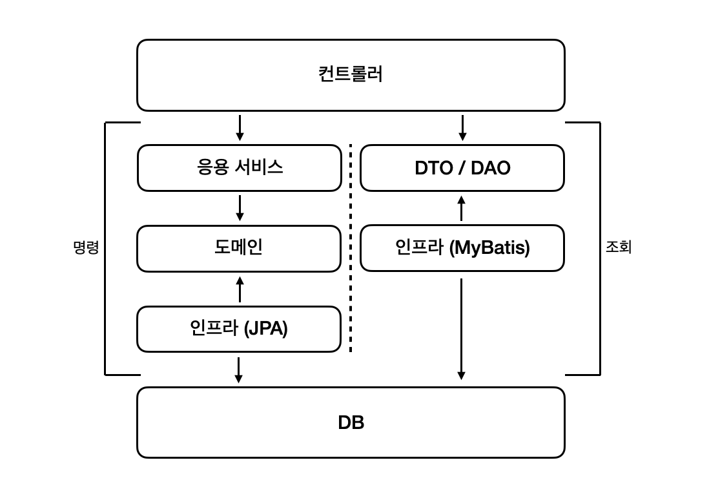

# 응용 서비스와 표현 영역

## 표현 영역과 응용 영역

- 도메인 영역이 제 기능을 하려면 사용자와 도메인을 연결해주는 매개체가 필요하다
- 응용 영역과 표현 영역이 사용자와 도메인 영역을 연결해주는 매개체 역할을 한다

### 표현 영역

- 표현 영역은 사용자의 요청을 해석한다
- 요청을 받은 표현 영역은 URL, 요청 파라미터, 쿠키, 헤더 등을 이용해서 사용자가 실행하고 싶은 기능을 판별하고 그 기능을 제공하는 응용 서비스를 실행한다
- 표현 영역은 응용 서비스가 요구하는 형식으로 사용자 요청을 변환한다
    
    ```java
    @PostMapping("/member/join")
    public ModelAndView join(HttpServletReuest request) {
    	// 사용자의 요청을 응용 서비스에 맞게 변환
    	String email = request.getParameter("email");
    	String password = request.getParameter("password");
    	JoinRequest joinReq = new JoinRequest(email, password);
    
    	// 응용 서비스 실행
    	joinService.join(joinReq);
    	:
    }
    ```
    

### 응용 영역

- 실제 사용자가 원하는 기능을 제공하는 것은 응용 영역에 위치한 서비스다
- 응용서비스는 기능을 실행하는데 필요한 입력 값을 메서드 인자로 받고 실행 결과를 리턴한다
- 응용 서비스는 표현 영역에 의존하지 않는다
- 사용자가 웹 브라우저를 사용하는지, REST API를 호출하는지 TCP 소켓을 사용하는지를 알 필요가 없다
- 기능 실행에 필요한 입력 값만 받고 실행 결과만 리턴한다

## 응용 서비스의 역할

- 응용 서비스의 **주요 역할**은 도메인 객체를 사용해서 사용자의 요청을 처리하는 것이다
(표현 영역 입장에서 보았을 때 응용 서비스는 도메인 영역과 표현 영역을 연결해주는 창구 역할을 한다)
- 응용 서비스는 주로 도메인 객체 간의 흐름을 제어하기 때문에 단순한 형태를 갖는다
    
    ```java
    public Result doSomeFunc(SomeReq req) {
    	// 리포지터리에서 애그리거트 구하기
    	SomeAg agg = someAggRepository.findById(req.getId());
    	// 애그리거트의 도메인 기능 실행하기
    	agg.doFunc(req.getValue());
    	// 결과 리턴하기
    	return createSuccessResult(agg);
    }
    
    public Result doSomeCreation(CreateSomeReq req) {
    	// 데이터 중복 등 데이터가 유효한지 검사하기
    	validate(req);
    	// 애그리거트를 생성
    	SomeAgg newAgg = createSome(req);
    	// 리포지터리에 애그리거트를 저장
    	someAggRepository.save(newAgg);
    	// 결과 리턴
    	return createSuccessResult(newAgg);
    }
    ```
    

### 도메인 로직 넣지 않기

- 도메인 로직을 도메인 영역과 응용 서비스에 분산해서 구현하면 코드 품질에 문제가 발생한다
    
    ```java
    public class ChangePasswordService {
    
    	public void changePassword(String memberId, String oldPw, String newPw) {
    		// 도메인 객체 간의 흐름을 제어하는 응용 서비스 로직
    		Member member = memberRepository.findById(memberId);
    		checkMemberExists(member);
    		member.changePassword(oldPw, newPw);
    	}
    
    }
    ```
    
    ```java
    public class ChangePasswordService {
    
    	public void changePassword(String memberId, String oldPw, String newPw) {
    		// 도메인의 핵심 로직을 직접 구현한 응용 서비스 로직
    		Member member = memberRepository.findById(memberId);
    		checkMemberExists(member);
    		if (!passwordEncoder.matches(oldPw, member.getPassword())
    			throw new BadPasswordException();
    		member.setPassword(newPw);
    	}
    
    }
    ```
    
- **문제 1 : 코드의 응집성이 떨어진다**
    - 도메인 데이터와 그 데이터를 조작하는 도메인 로직이 한 영역에 위치하지 않고 서로 다른 영역에 위치한다는 것은 도메인 로직을 파악하기 위해 여러 영역을 분석해야 한다는 것을 의미한다
- **문제 2 : 여러 응용 서비스에서 동일한 로직을 구현할 가능성이 높아진다**
    - 만약, 비정상적인 계정 정지를 막기 위해 암호를 확인한다고 한다면, 다음과 같이 암호를 확인하는 코드를 또 구현해야 한다
        
        ```java
        public class DeactivationService {
        
        	public void deactivate(String memberId, String pwd) {
        		Member member = memberRepository.findById(memberId);
        		checkMemberExists(member);
        		if (!passwordEncoder.matches(oldPw, member.getPassword())
        			throw new BadPasswordException();
        		member.deactivate();
        	}
        
        }
        ```
        
    - 코드 중복을 막기 위해 응용 서비스 영역에 별도의 보조 클래스를 만들 수 있겠지만, 이보다는 암호 데이터를 가진 Member 객체에 암호 확인 기능을 구현하고 응용 서비스에서는 도메인이 제공하는 기능을 사용하면 응용 서비스가 도메인 로직을 구현하면서 발생하는 코드 증복 문제는 발생하지 않는다

<aside>
💡 *응용 서비스가 복잡하다면 응용 서비스에서 도메인 로직의 일부를 구현하고 있을 가능성이 높다*

</aside>

- 일부 도메인 로직이 응용 서비스에 출현하면서 발생하는 문제는 결과적으로 코드 변경을 어렵게 만든다
- 변경이 어렵다는 것은 그만큼 소프트웨어의 가치가 떨어진다는 것을 의미한다
- 소프트웨어의 가치를 높이려면 도메인 로직을 도메인 영역에 모아서 코드 중복을 줄이고 응집도를 높여야 한다

## 응용 서비스의 구현

- 응용 서비스는 표현 영역과 도메인 영역을 연결하는 매개체 역할을 하는데 이는 디자인 패턴에서 파사드와 같은 역할을 한다

### 응용 서비스의 크기

- 회원 도메인을 생각해보자
    - 응용 서비스는 회원 가입하기/탈퇴하기/암호변경하기/비밀번호초기화 같은 기능을 구현하기 위해 도메인 모델을 사용하게 된다
- 이 경우 응용 서비스는 보통 다음의 두가지 방법 중 한가지 방식으로 구현한다
    - 한 응용 서비스 클래스에 회원 도메인의 모든 기능 구현하기
    - 구분되는 기능별로 응용 서비스 클래스를 따로 구현하기
- 방법 1 : *“한 응용 서비스 클래스에 회원 도메인의 모든 기능 구현하기”*
    
    ```java
    public class MemberService {
    	private MemberRepository memberRepository;
    	public void join(MemberJoinRequest joinRequest) { ... }
    	public void changePassword(String memberId, String curPw, String newPw) { ... }
    	public void initializePassword(String memberId) { ... }
    	public void leave(String memberId, String curPw) { ... }
    }
    ```
    
    - 한 도메인과 관련된 기능을 구현한 코드가 한 클래스에 위치하므로 각 기능에서 동일 로직에 대한 코드 중복을 제거할 수 있다는 **장점**이 있다
    (예 : changePassword(), initializePassword(), leave()는 회원이 존재하지 않으면 NoMemberException이 발생)
    - 각 기능에서 동일한 로직을 위한 코드 중복을 제거하기 쉽다는 것이 장점이라면,
    한 서비스 클래스의 크기가 커진다는 **단점**도 있다
    - 코드의 크기가 커지면 연관성이 적은 코드가 한 클래스에 함께 위치할 가능성이 높아지게 되는 결과적으로 관련 없는 코드가 뒤섞여 코드를 이해하는 데 방해가 된다
    (예 : 암호 초기화 기능을 구현한 initializePassword() 메소드는 암호 초기화 후에 신규 암호를 사용자에게 통지하기 위해 Notifier를 사용하는데, 이 Notifier는 암호 변경 기능을 구현한 changePassword() 메소드에서는 필요하지 않은 기능이다)
    - 게다가 한 클래스에 코드가 모이기 시작하면 엄연히 분리하는 것이 좋은 상황임에도, 습관적으로 기존에 존재하는 클래스에 억지로 끼워넣게 된다
    - 이것은 코드를 점점 얽히게 만들어 코드 품질을 낮추게 한다
- 방법 2 : *“구분되는 기능별로 응용 서비스 클래스를 따로 구현하기”*
    - 이 방식은 한 응용 서비스 클래스에서 한 개 내지 2~3개의 기능을 구현한다
        
        ```java
        public class ChangePasswordService {
        
        	public void changePassword(String memberId, String oldPw, String newPw) {
        		Member member = memberRepository.findById(memberId);
        		if (member==null) throw new NoMemberExcetpion(memberId);
        		member.changePassword(oldPw, newPw);
        	}
        
        }
        ```
        
    - 이 방식을 사용하면 클래스 개수는 많아지지만 한 클래스에 관련 기능을 모두 구현하는 것과 비교해서 코드 품질을 일정 수준으로 유지하는데 도움이 된다
    - 또한 각 클래스별로 필요한 의존 객체만 포함하므로 다른 기능을 구현한 코드에 영향을 받지 않는다
    - 각 기능마다 동일한 로직을 구현할 경우 여러 클래스에 중복해서 동일한 코드를 구현할 가능성이 있다
    - 이 경우 다음과 같이 별도 클래스에 로직을 구현해서 코드가 중복되는 것을 방지할 수 있다
    

### 응용 서비스의 인터페이스와 클래스

- 응용 서비스를 구현할 때 논쟁이 될만한 것이 ‘인터페이스가 필요한지’ 이다
- 인터페이스가 필요한 상황이 있다 : 구현 클래스가 다수 존재하거나 런타임에 구현 객체를 교체하는 경우
- 하지만 응용 서비스는 런타임에 교체하는 경우가 거의 없고 한 응용 서비스의 구현 클래스가 두 개인 경우도 드물다
- 이런 이유로 인터페이스와 클래스를 따로 구현하면 소스 파일만 많아지고 구현 클래스에 대한 간접 참조가 증가해서 전체 구조가 복잡해진다
- 따라서 인터페이스가 명확하게 필요하기 전까지는 응용 서비스에 대한 인터페이스를 작성하는 것이 좋은 선택이라고 볼 수는 없다

### 메소드 파라미터와 값 리턴

**메소드 파라미터**

- 응용 서비스가 제공하는 메소드는 도메인을 이용해서 사용자가 요구한 기능을 실행하는데 필요한 값을 파라미터로 전달받아야 한다
- 개별 파라미터로 전달받을수도 있지만, 별도 데이터 클래스를 만들어 전달받을 수도 있다
- 스프링 MVC같은 웹 프레임워크는 웹 요청 파라미터를 자바 객체로 변환하는 기능을 제공하므로 응용 서비스에 데이터로 전달할 요청 파라미터가 두 개 이상 존재하면 데이터 전달을 위한 별도 클래스를 사용하는 것이 편리하다

**값 리턴**

- 응용 서비스의 결과를 표현 영역에서 사용해야 하면 응용 서비스 메소드의 결과로 필요한 데이터를 리턴한다
- 결과 데이터가 필요한 대표적인 예가 식별자다
    
    ```java
    public class OrderService {
    	@Transactional
    	public OrderNo placeOrder(OrderRequest request) {
    		OrderNo orderNo = orderRepository.nextId();
    		Order order = createOrder(orderNo, orderRequest);
    		orderRepository.save(order);
    		return orderNo;
    	}
    }
    ```
    
- 표현 영역 코드는 응용 서비스가 리턴한 값을 사용해서 사용자에게 알맞은 결과를 보여줄 수 있게 된다
- 응용 서비스에서 애그리거트 객체를 그대로 리턴할 수도 있다
    
    ```java
    public class OrderService {
    	@Transactional
    	public OrderNo placeOrder(OrderRequest request) {
    		OrderNo orderNo = orderRepository.nextId();
    		Order order = createOrder(orderNo, orderRequest);
    		orderRepository.save(order);
    		return order;
    	}
    }
    ```
    
    - 하지만 응용 서비스에서 애그리거트 자체를 리턴하면 도메인의 로직 실행할 수 있는 영역이 응용 서비스와 표현 영역 두 곳에서 할 수 있게 된다
    - 애그리거트의 상태를 변경하는 응용서비스가 애그리거트를 리턴해도 애그리거트가 제공하는 기능을 컨트롤러나  코드에서 실행하면 안된다는 규칙을 정할 수 있겠지만, 그보다는 응용 서비스는 표현 영역에서 필요한 데이터만 리턴하는 것이 기능 실행 로직의 응집도를 높이는 확실한 방법이다

### 표현 영역에 의존하지 않기

- 응용 서비스의 파라미터 타입을 결정할 때 주의할 점은 표현 영역과 관련된 타입을 사용하면 안된다는 점이다
    - 예를 들면 다음과 같이 표현 영역에 해당하는 `HttpServletRequest`나 `HttpSession`을 응용 서비스에 파라미터로 전달하는 것
- 응용 서비스에서 표현 영역에 대한 의존이 발생하면..
    - 응용 서비스만 단독으로 테스트하기 어려워지며
    - 응용 서비스가 표현 영역의 역할까지 대신하는 상황이 벌어질 수 있고
    - 표현 영역의 구현이 변경되면 응용 서비스의 구현도 함께 변경해야 한다
    - 즉, 표현 영역의 응집도가 깨진다

### 트랜잭션 처리

- 트랜잭션을 관리하는 것은 응용 서비스의 중요한 역할이다
- 스프링과 같은 프레임워크가 제공하는 트랜잭션 관리 기능을 이용하면 쉽게 트랜잭션을 처리할 수 있다
- 프레임워크가 제공하는 트랜잭션 기능을 적극 사용하는 것이 좋다
- 프레임워크가 제공하는 규칙을 따르면 간단한 설정만으로 트랜잭션을 시작하여 커밋하고 익셉션이 발생하면 롤백할 수 있다

## 표현 영역

표현 영역의 책임의 아래와 같다

- 사용자가 시스템을 사용할 수 있는 흐름을 제공하고 제어한다
    - 웹 서비스의 표현 영역은 사용자가 요청한 내용을 응답으로 제공한다
    - 응답에는 다음 화면으로 이동할 수 있는 링크나 데이터를 입력하는데 필요한 폼 등이 포함된다
- 사용자의 요청을 알맞은 응용 서비스에 전달하고 결과를 사용자에게 제공한다
    - 화면을 보여주는데 필요한 데이터를 읽거나 도메인의 상태를 변경해야 할 때 응용 서비스를 사용한다
    - 이 과정에서 표현 영역은 사용자의 요청 데이터를 응용 서비스가 요구하는 형식으로 변환하고 응용 서비스의 결과를 사용자에게 응답할 수 있는 형식으로 변환한다
- 사용자의 세션을 관리한다
    - 세션 관리는 권한 검사와도 연결된다

## 값 검증

- 값 검증은 표현 영역과 응용 서비스 두 곳에서 모두 수행할 수 있다
- 원칙적으로 모든 값에 대한 검증은 응용 서비스에서 처리한다
- 표현 영역은 잘못된 값이 존재하면 이를 사용자에게 알려주고 값을 다시 입력받아야 한다
- 스프링 MVC는 폼에 입력한 값이 잘못된 경우 에러 메시지를 보여주기 위한 용도로 Errors나 BindingResult를 사용하는데, 컨트롤러에서 위와 같은 응용 서비스를 사용하면 폼에 에러메시지를 보여주기 위해 다음과 같이 다소 번잡한 코드를 작성해야 한다
    
    ```java
    @Controller
    public class Controller {
    	@PostMapping("/member/join")
    	public String join(JoinRequest joinRequet, Errors errors) {
    		try {
    			joinSerice.join(joinRequest);
    			return successView;
    		} catch (EmptyPropertyExcetpion ex) {
    			errors.rejectValue(ex.getPropertyName(), "empty");
    			return formView;
    		} catch (InvalidPropertyExcetpion ex) {
    			return formView;
    			errors.rejectValue(ex.getPropertyName(), "invalid");
    			return formView;
    		} catch (DuplicatedIdPropertyExcetpion ex) {
    			errors.rejectValue(ex.getPropertyName(), "duplicate");
    			return formView;
    		}
    	}
    }
    ```
    
- 응용 서비스에서 각 값이 유효한지 확인할 목적으로 익셉션을 사용할 때의 문제점은 사용자에게 좋지 않은 경험을 제공한다는 것이다
    - 사용자는 폼에 값을 입력하고 전송했는데 입력한 값이 잘못되어 다시 폼에 입력해야 할 때 한 개 항목이 아닌 입력한 모든 항목에 대해 잘못된 값이 존재하는지 알고 싶을텐데,
    응용 서비스에서 값을 검사하는 시점에 첫 번째 값이 올바르지 않아 익셉션을 발생시키면 나머지 항목에 대해서는 값을 검사하지 않게 되는데,
    사용자는 첫 번째 값에 대한 에러 메시지만 보게 되고 나머지 항목에 대해서는 값이 올바른지 알 수 없게 된다
- 사용자의 불편을 해소하기 위해 응용 서비스에서 에러 코드를 모아 하나의 익셉션으로 발생시키는 방법도 있다
    - 잘못된 값이 존재하면 잘못된 값을 푠현하는 ValidationError를 생성해서 errors 목록에 추가한다
    - 값 검증이 끝난 뒤에 errors에 값이 존재하면 errors 목록을 갖는 ValidationErrorExcetpion을 발생시켜 입력 파라미터 값이 유효하지 않다는 사실을 알린다
        
        ```java
        @Trasactional
        public OrderNo placeOrder(OrderRequest orderRequest) {
        	List<ValidationError> errors = new ArrayList<>();
        	if(orderRequest==null) {
        		errors.add(ValidationError.of("empty"));
        	} else {
        		if(orderRequest.getOrdererMemberId()==null)
        			errors.add(ValidationError.of("ordererMemberId","empty"));
        		if(orderRequest.getOrderProducts()==null)
        			errors.add(ValidationError.of("orderProducts","empty"));
        		if(orderRequest.getOrderProducts().isEmpty())
        			errors.add(ValidationError.of("orderProducts","empty"));
        	}
        	if(!errors.isEmpty())
        		throw new ValidationErrorException(errors);
        }
        ```
        
- 표현 영역에서 필수 값을 검증하는 방법도 있다
    
    ```java
    @Controller
    public class Controller {
    	@PostMapping("/member/join")
    	public String join(JoinRequest joinRequet, Errors errors) {
    		checkEmpty(joinRequest.getId(), "id", errors);
    		checkEmpty(joinRequest.getName(), "name", errors);
    		:
    		if(errors.hasErrors())
    			return formView;
    
    		try {
    			joinSerice.join(joinRequest);
    			return successView;
    		} catch (DuplicatedIdPropertyExcetpion ex) {
    			errors.rejectValue(ex.getPropertyName(), "duplicate");
    			return formView;
    		}
    	}
    	
    	private void checkEmpty(String value, String property, Errors errors) {
    		if (isEmpty(value))
    			errors.rejectValue(property, "empty");
    	}
    }
    ```
    
- 이렇게 표현 영역에서 필수 값과 값의 형식을 검사하면 실질적으로 응용 서비스는 ID 중복 여부와 같은 논리적 오류만 검사하면 된다
- 즉, 표현 영역과 응용 서비스가 값 검사를 나눠서 수행하는 것이다
    - 표현 영역 : 필수 값, 값의 형식, 범위 등을 검증한다
    - 응용 서비스 : 데이터의 존재 유무와 같은 논리적 오류를 검증한다
- 응용 서비스에서 얼마나 엄격하게 값을 검증해야 하는지에 대해서는 의견이 갈릴 수 있다
    - 표현 영역에서 필수 값을 검증하고 응용 서비스에서는 논리적 오류 검증한다
    **VS**
    가능하면 응용 서비스에서 필수 값 검증과 논리적 검증을 모두 한다
    - 응용 서비스에서 필요한 값 검증을 모두 처리하면 프레임워크가 제공하는 검증 기능을 사용할 때보다 작성할 코드가 늘어나는 불편함이 있지만 반대로 응용 서비스의 완성도가 높아지는 이점이 있다

## 권한 검사

- 개발하는 시스템마다 권한의 복잡도가 다르다
- 단순한 시스템은 인증 여부만 검사하면 되는데 반해, 어떤 시스템은 관리자인지에 따라 사용할 수 있는 기능이 달라지기도 하고 실행할 수 있는 기능이 역할마다 달라지는 경우도 있다
- 다음 세 곳에서 권한 검사를 수행할 수 있다
    - 표현 영역
    - 응용 서비스
    - 도메인
- 표현 영역에서 할 수 있는 기본적인 검사는 인증된 사용자인지 아닌지 검사하는 것이다
(대표적인 예 : 회원 정보 변경 기능)
    - 회원 정보 변경과 관련된 URL은 인증된 사용자만 접근해야 한다
    - 표현 영역은 URL을 처리하는 컨트롤러에 웹 요청을 전달하기 전에 인증 여부를 검사해서 인증된 사용자의 웹 요청만 컨트롤러에 전달한다
    - 인증된 사용자가 아닐 경우 로그인 화면으로 리다이렉트시킨다
    - 이런 접근 제어를 하기에 좋은 위치가 서블릿 필터이다
    - 서블릿 필터에서 사용자의 인증 정보를 생성하고 인증 여부를 검사한다
    (인증된 사용자면 다음 과정을 진행하고, 그렇지 않으면 로그인 화면이나 에러 화면을 보여준다)
    - 인증 여부 뿐 아니라 권한에 대해서도 동일한 방식으로 필터를 사용해서 URL별 권한 검사를 할 수 있다
- URL 만으로 접근 제어를 할 수 없는 경우 응용 서비스의 메소드 단위로 권한 검사를 수행해야 한다
    - 그러나 꼭 응용 서비스의 코드에서 직접 권한 검사를 해야 한다는 것은 아니다
    - 스프링 시큐리티는 AOP를 활용해서 애너테이션으로 서비스 메소드에 대한 권한 검사를 할 수 있다
        
        ```java
        public class BlockMemberService {
        	private MemberRepository memberRepository;
        	
        	@PreAuthorize("hasRole('ADMIN')")
        	public void block(String memberId) {
        		...
        	}
        }
        ```
        
- 개별 도메인 객체 단위로 권한 검사를 해야 하는 경우는 구현이 복잡해진다
    - 응용 서비스의 메소드 수준에서 권한 검사를 할 수 없기 때문에 다음과 같이 직접 권한 검사 로직을 구현해야 한다
        
        ```java
        public class DeleteArticleService {
        	public void delete(String userId, Long articleId) {
        		Article article = articleRepositoryfindById(articleId);
        		checkArticleExistence(article);
        		// 직접 권한 검사를 한다
        		permissionService.checkDeletePermission(userId, article);
        		article.markDeleted();
        	}
        }
        ```
        
    - 스프링 시큐리티와 같은 보안 프레임워크를 확장해서 개별 도메인 객체 수준의 권한 검사 기능을 프레임워크에 통합할 수 있다
    - 도메인 객체 수준의 권한 검사 로직을 도메인별로 다르므로 도메인에 맞게 보안 프레임워크를 확장하려면 프레임워크에 대한 높은 이해가 필요하다
    - 이해도가 높지 않아 프레임워크 확장을 원하는 수준으로 할 수 없다면, 도메인에 맞는 권한 검사 기능을 직접 구현하는 것이 코드 유지 보수에 유리하다

## 조회 전용 기능과 응용 서비스

- 서비스에서 이들 조회 전용 기능을 사용하면 서비스 코드가 다음과 같이 단순히 조회 전용 기능을 호출하는 형태로 끝날 수 있다
    
    ```java
    public class OrderListService {
    	public List<OrderView> getOrderList(String ordererId) {
    		return orderViewDao.selectByOrderer(ordererId);
    	}
    }
    ```
    
- 서비스에서 수행하는 추가적인 로직이 없을 뿐더러 단일 쿼리만 실행하는 조회 전용 기능이어서 트랜잭션이 필요하지도 않다
- 이 경우라면 굳이 서비스를 만들 필요 없이 표현 영역에서 바로 조회 전용 기능을 사용해도 문제가 없다
- 즉, 조회를 위한 응용 서비스가 단지 조회 전용 기능을 실행하는 코드밖에 없다면 응용 서비스를 생략해도 무방하다
    
    