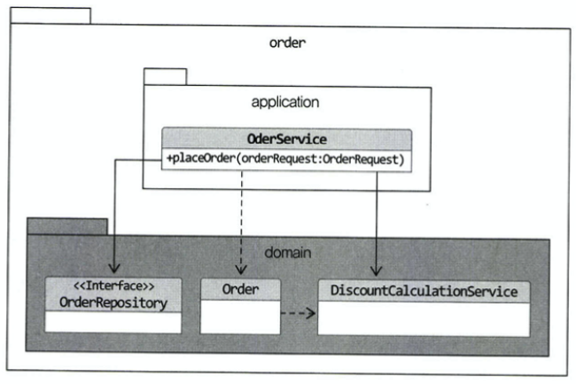

# Chapter 7. 도메인 서비스

## 여러 애그리거트가 필요한 기능

---

- 한 애그리거트로 기능을 구현할 수 없을 때 ex> 결제 금액 계산 로직
    - 상품 애그리거트: 구매하는 상품의 가격이 필요하다. 또한 상품에 따라 배송비가 추가되기도 한다.
    - 주문 애그리거트: 상품별로 구매 개수가 필요하다.
    - 할인 쿠폰 애그리거트: 쿠폰별로 지정한 할인 금액이나 비율에 따라 주문 총 금액을 할인한다.
        - 할인 쿠폰을 조건에 따라 중복 사용할 수 있다거나 지정한 카테고리의 상품에만 적용할 수 있다는 제약 조건이 있다면 할인 계산이 복잡해진다.
    - 회원 애그리거트: 회원 등급에 따라 추가 할인이 가능하다.

❓의문점

- 이 상황에서 실제 결제 금액을 계산해야 하는 주체는 어떤 애그리거트일까?
- 할인 금액을 구하는 것은 누구 책임일까?
- 할인 쿠폰이 할인 규칙을 갖고 있으니 할인 쿠폰 애그리거트가 계산해야 할까?

- 👉 생각해 볼 수 있는 방법: 주문 애그리거트가 필요한 애그리거트나 필요 데이터를 모두 가지도록 한 뒤 할인 금액 계산 책임을 주문 애그리거트에 할당하는 것
    
    ```java
    public class Order {
        ...
        private Orderer orderer;
        private List<OrderLine> orderLines;
        private List<Coupon> usedCoupons;
    
        private Money calculatePayAmounts {
            Money totalAmounts = calculateTotalAmounts();
            // 쿠폰별로 할인 금액을 구한다.
            Money discount = coupons.stream()
                                     .map(coupon -> calculateDiscount(coupon))
                                     .reduce(Money(0), (v1, v2) -> v1.add(v2))
            // 회원에 따른 추가 할인을 구한다.
            Money membershipDiscount =
                calculateDiscount(orderer.getMember().getGrade());
            // 실제 결제 금액 계산
            return totalAmounts.minus(discount).minus(membershipDiscount);
        }
    
        private Money calculateDiscount(Coupon coupon) {
            // orderLines의 각 상품에 대해 쿠폰을 적용해서 할인 금액 계산하는 로직.
            // 쿠폰의 적용 조건 등을 확인하는 코드
            // 정책에 따라 복잡한 if-else와 계산 코드
            ...
        }
    
        private Money calculateDiscount(MemberGrade grade) {
            // 등급에 따라 할인 금액 계산
        }
    }
    ```
    

😵 한 애그리거트에 넣기에 애매한 도메인 기능을 특정 애그리거트에서 억지로 구현하면 안 된다.

- 자신의 책임 범위를 넘어서는 기능을 구현하기 때문에 코드가 길어지고 외부에 대한 의존이 높아지게 된다 → 코드를 복잡하게 만들어 수정을 어렵게 만드는 요인이 된다.

😃 이런 문제를 해소하는 가장 쉬운 방법: 도메인 서비스를 별도로 구현하는 것

### 도메인 서비스

---

- 응용 영역의 서비스: 응용 로직을 다룬다.
- 도메인 서비스: 도메인 로직을 다룬다.

- 도메인 서비스가 도메인 영역의 애그리거트나 밸류와 같은 다른 구성요소와 비교할 때 다른 점
    - 상태 없이 로직만 구현한다.
    - 도메인 서비스를 구현하는 데 필요한 상태는 애그리거트나 다른 방법으로 전달받는다.

- 할인 금액 계산 로직을 위한 도메인 서비스
    
    ```java
    public class DiscountCalculationService {
        public Money calculateDiscountAmounts(List<OrderLIne> orderLines,
                List<Coupon> coupons, MemberGrade grade) {
            Money couponDiscount =
                coupons.stream()
                        .map(coupon -> calculateDiscount(coupon))
                        .reduce(Money(0), (v1, v2) -> v1.add(v2));
    
            Money membershipDiscount =
                calculateDiscount(orderer.getMember().getGrade());
    
            return couponDiscount.add(membershipDiscount);
        }
    
        private Money calculateDiscount(Coupon coupon) {
            ...
        }
    
        private Money calculateDiscount(MemberGrade grade) {
            ...
        }
    }
    ```
    

❗할인 계산 서비스를 사용하는 주체는 애그리거트가 될 수도 있고 응용 서비스가 될 수도 있다. 

- DiscountCalculationService를 다음과 같이 애그리거트의 결제 금액 계산 기능에 전달하면 사용 주체는 애그리거트가 된다.
    
    ```java
    public class Order {
        public void calculateAmounts(
                DiscountCalculationService disCalSvc, MemberGrade grade) {
        Money totalAmounts = getTotalAmounts();
        Money discountAmounts =
                disCalSvc.calculateDiscountAmounts(this.orderLines, this.coupons, greade);
        this.paymentAmounts = totalAmounts.minus(discountAmounts);
    	}
    	...
    ```
    
- 애그리거트 객체에 도메인 서비스를 전달하는 것은 응용 서비스 책임이다.
    
    ```java
    public class OrderService {
        private DiscountCalculationService discountCalculationService;
    
        @Transactional
        public OrderNo placeOrder(OrderRequest orderRequest) {
            OrderNo orderno = orderRepository.nextId();
            Order order = createOrder(orderNo, orderRequest);
            orderRepository.save(order);
            // 응용 서비스 실행 후 표현 영역에서 필요한 값 리턴
    
            return orderNo;
        }
    
        private Order createOrder(OrderNo orderNo, OrderRequest orderReq) {
            Member member =findMember(orderReq.getOrdererId());
            Order order = new Order(orderNo, orderReq.gerOrderLines(),
                    orderReq.getCoupons(), createOrderer(member),
                    orderReq.getShippingInfo());
            order.calculateAmounts(this.discountCalculationService,
                    member.getGrade());
            return order;
        }
        ...
    ```
    

- ❗도메인 서비스 객체를 애그리거트에 주입하지 않기
    - 애그리거트의 메서드를 실행할 때 도메인 서비스 객체를 파라미터로 전달한다는 것은 애그리거트가 도메인 서비스에 의존한다는 것을 뜻한다. 스프링의 DI와 AOP를 공부하다 보면 애그리거트가 의존하는 도메인 서비스를 의존 주입으로 처리하고 싶어질 수 있다 👉 이는 좋은 방법이 아니라고 생각한다.
        
        ```java
        public class Order {
            @Autowired
            private DiscountCalculationService discountCalculationService;
            ...
        }
        ```
        
    - 도메인 객체는 필드(프로퍼티)로 구성된 데이터와 메서드를 이용한 기능을 이용해서 개념적으로 하나인 모델을 표현한다. 모델의 데이터를 담는 필드는 모델에서 중요한 구성요소이다. 그런데, DiscountCalculationService 필드는 데이터 자체와는 관련이 없다. Order 객체를 DB에 보관할 때 다른 필드와는 달리 저장 대상도 아니다.
    - 또 Order가 제공하는 모든 기능에서 DiscountCalculationService를 필요로 하는 것도 아니다. 일부 기능만 필요로 한다. 일부 기능을 위해 굳이 도메인 서비스 객체를 애그리거트에 의존 주입할 이유는 없다. 이는 프레임워크의 기능을 사용하고 싶은 개발자의 욕심을 채우는 것에 불과하다.

- 애그리거트 메서드를 실행할 때 도메인 서비스를 인자로 전달하지 않고 반대로 도메인 서비스의 기능을 실행할 때 애그리거트를 전달하기도 한다 ex> 계좌 이체 기능
    
    ```java
    public class TransferService {
        public void transfer(Account fromAcc, Account toAcc, Money amounts) {
            fromAcc.withdraw(amounts);
            toAcc.credit(amounts);
        }
        ...
    ```
    
    - 응용 서비스는 두 Account 애그리거트를 구한 뒤에 해당 도메인 영역의 TransferService를 이용해서 계좌 이체 도메인 기능을 실행
- ❗도메인 서비스는 도메인 로직을 수행하지 응용 로직을 수행하지는 않는다. 트랜잭션 처리와 같은 로직은 응용 로직이므로 도메인 서비스가 아닌 응용 서비스에서 처리해야 한다.

> 특정 기능이 응용 서비스인지 도메인 서비스인지 감을 잡기 어려울 때는 해당 로직이 애그리거트의 상태를 변경하거나 애그리거트의 상태 값을 계산하는지 검사해 보면 된다. 예를 들어, 계좌 이체 로직은 계좌 애그리거트의 상태를 변경한다. 결제 금액 로직은 주문 애그리거트의의 주문 금액을 계산한다. 이 두 로직은 각각 애그리거트를 변경하고 애그리거트의 값을 계산하는 도메인 로직이다. 도메인 로직이면서 한 애그리거트에 넣기 적합하지 않으므로 이 두 로직은 도메인 서비스로 구현하게 된다.
> 

### 도메인 서비스의 패키지 위치

---

- 도메인 서비스는 도메인 로직을 실행
    
    → 도메인 서비스의 위치는 다른 도메인 구성 요소와 동일한 패키지에 위치한다.
    
    
    
    7.1 도메인 서비스는 도메인 영역에 위치한다.
    
- 도메인 서비스의 개수가 많거나 엔티티나 밸류와 같은 다른 구성요소와 명시적으로 구분하고 싶다면 domain 패키지 밑에 하위 패키지를 구분해서 위치시켜도 된다.
    - domain.model
    - domain.service
    - domain.repository

### 도메인 서비스의 인터페이스와 클래스

---

- 도메인 서비스의 로직이 고정되어 있지 않은 경우 도메인 서비스 자체를 인터페이스로 구현하고 이를 구현한 클래스를 둘 수도 있다. 특히 도메인 로직을 외부 시스템이나 별도 엔진을 이용해서 구현해야 할 경우에 인터페이스와 클래스를 분리하게 된다.
    
    
    
    7.2 도메인 서비스의 구현이 특정 기술에 종속되면 인터페이스와 구현 클래스로 분리한다.
    
- 도메인 서비스의 구현이 특정 구현 기술에 의존적이거나 외부 시스템의 API를 실행한다면 도메인 영역의 도메인 서비스는 인터페이스로 추상화해야 한다.

👉 도메인 영역이 특정 구현에 종속되는 것을 방지할 수 있고 도메인 영역에 대한 테스트가 수월해진다.

- 참고
    - [https://incheol-jung.gitbook.io/docs/study/ddd-start/7](https://incheol-jung.gitbook.io/docs/study/ddd-start/7)
    - [https://github.com/softpeanut/dul-dul-dul/blob/f7bc27db77475e62a27e1ff6d7f5ffb3eb4918c2/도메인 주도 개발 시작하기/Chapter07. 도메인 서비스/02. 도메인 서비스.md](https://github.com/softpeanut/dul-dul-dul/blob/f7bc27db77475e62a27e1ff6d7f5ffb3eb4918c2/%EB%8F%84%EB%A9%94%EC%9D%B8%20%EC%A3%BC%EB%8F%84%20%EA%B0%9C%EB%B0%9C%20%EC%8B%9C%EC%9E%91%ED%95%98%EA%B8%B0/Chapter07.%20%EB%8F%84%EB%A9%94%EC%9D%B8%20%EC%84%9C%EB%B9%84%EC%8A%A4/02.%20%EB%8F%84%EB%A9%94%EC%9D%B8%20%EC%84%9C%EB%B9%84%EC%8A%A4.md)
