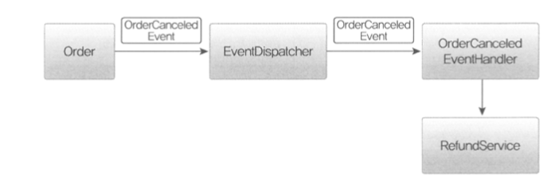
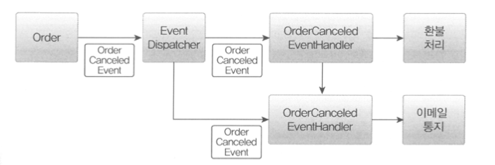
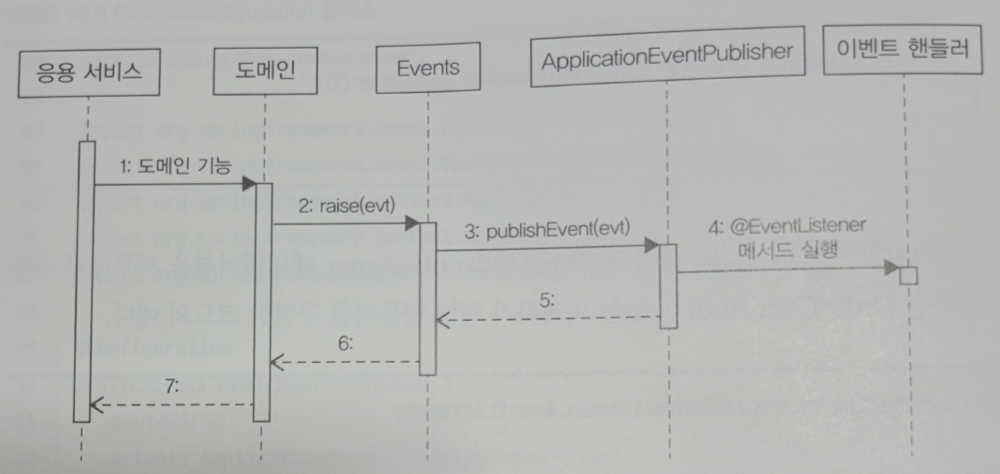
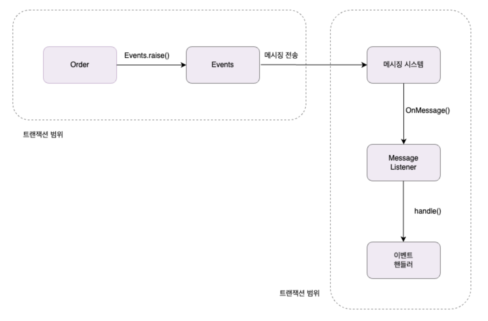
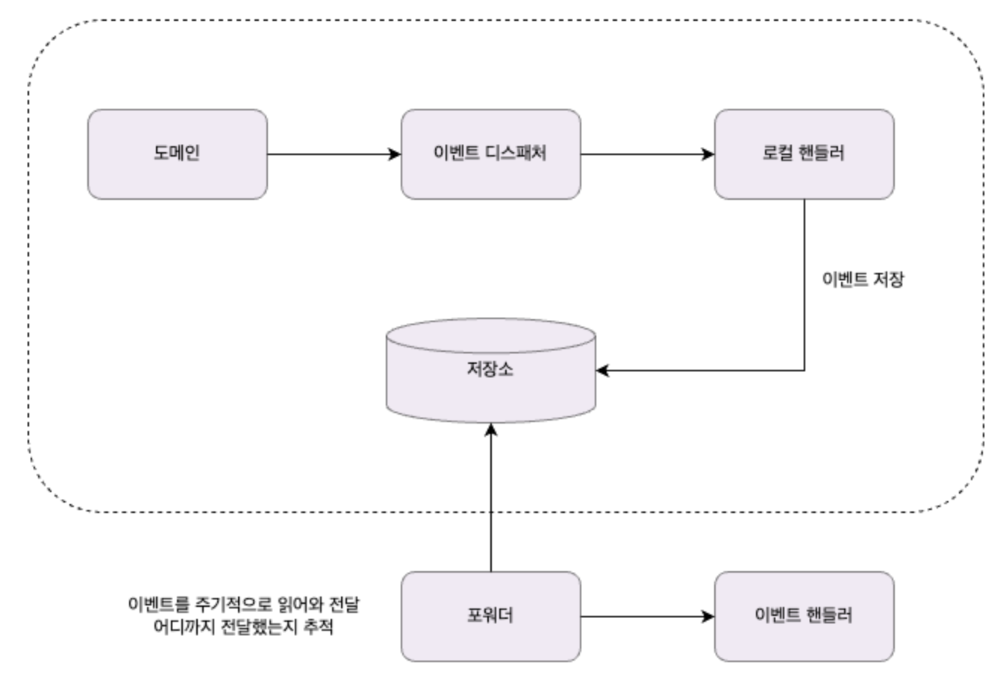
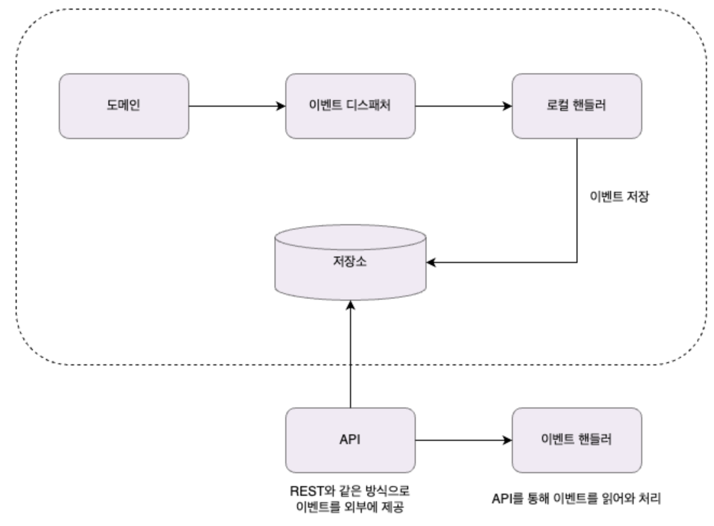

# 이벤트

## 시스템 간 강결합 문제

- 도메인 객체에서 환불 기능을 실행
    
    ```java
    public class Order {
      public void cancel(RefundService refundService) {
        verifyNotYetShipped();
        this.state = OrderState.CANCELED;
    
        this.refundStatus = State.REFUND_STARTED;
        try {
          refundService.refund(getPaymentId());
          this.refundStatus = State.REFUND_COMPLETED;
        } catch(Exception ex) {
          ...
        }
      }
    }
    ```
    
- 보통 결제 시스템은 외부에 존재하므로 `RefundService`는 외부에 있는 결제 시스템이 제공하는 환불 서비스를 호출한다
- 따라서 발생하는 이슈들
    - 외부 서비스가 정상이 아닌 경우의 트랜잭션 처리
        - 환불 기능을 실행하는 과정에서 익셉션 발생 → 롤백해야 할까? 아니면 일단 커밋?
        - 외부의 환불 서비스를 실행하는 과정에서 익셉션이 발생하면 환불에 실패했으므로 주문 취소 트랜잭션을 롤백하는 것이 맞아보인다
        - 하지만 반드시 트랜잭션을 롤백해야 하는 것은 아니다
        - 주문은 취소 상태로 변경하고 환불만 나중에 다시 시도하는 방식으로 처리할 수도 있다
    - 외부 서비스의 성능
        - 환불을 처리하는 외부 시스템의 응답 시간이 길어지면 그만큼 대기하는 시간도 길어진다
        - 환불 처리 기능이 30초가 걸리면 주문 취소 기능은 최소 30초만큼 대기해야 한다
        - 즉, 외부 서비스 성능에 직접적인 영향을 받는다
    - 도메인 객체에 서로 다른 도메인 로직이 섞임
        - 주문 로직과 결제 로직이 섞일수도 있다
        - 환불 기능이 바뀌면 Order도 영향을 받는다는 것을 의미한다
- 만약 주문을 취소한 뒤에 환불 뿐만 아니라 취소했다는 내용을 통지해야 한다면..?
    - 앞의 이슈들이 다같이 극대화된다
- 왜 이러한 문제가 발생할까? → **바운디드 컨텍스트들의 강결합**때문
    - (주문 바운디드 컨텍스트와 결제 바운디드 컨텍스트 간의 강결합)
- 바운디드 컨텍스트들의 강결합을 없앨 수 있는 방법 : ‘**이벤트**’
- 특히, 비동기 이벤트를 사용하면 두 시스템 간의 결합을 크게 낮출 수 있다

## 이벤트 개요

### 이벤트 관련 구성요소

- 이벤트
- 이벤트 생성 주체
    - 도메인 객체 (엔티티, 밸류, 도메인 서비스)
- 이벤트 디스패처 (publisher)
    - 이벤트를 생성해서 디스패처에 이벤트를 전달한다
    - 이벤트를 전달받은 디스패처는 해당 이벤트를 처리할 수 있는 핸들러에 이벤트를 전파한다
    - 이벤트 디스패처의 구현 방식에 따라 이벤트 생성과 처리를 동기나 비동기로 실행한다
- 이벤트 핸들러 (subscriber)
    - 이벤트 생성 주체가 발생한 이벤트에 반응한다
    - 생성 주체가 발행한 이벤트를 전달받아 이벤트에 담긴 데이터를 이용해서 원하는 기능을 실행한다
    - ex : ‘주문 취소됨’을 받는 이벤트 핸들러는 해당 주문의 주문자에게 SMS로 주문취소 사실을 통지한다

### 이벤트 구성

- 이벤트 종류 : 클래스 이름으로 이벤트 종류를 표현
- 이벤트 발생 시간
- 추가 데이터 : 주문번호, 신규 배송지 정보 등 이벤트와 관련된 정보

```java
public class ShippingInfoChangedEvent {
  private String orderNumber;
  private long timestamp;
  private ShippingInfo newShippingInfo;
}
```

- 이벤트는 현재 기준으로 과거에 벌어진 것을 표현하기 때문에 이벤트 이름에는 과거 시제를 사용한다
- 이벤트에는 이벤트 핸들러가 작업을 수행하는데 필요한 데이터를 담아야 한다
    - 데이터가 부족하면 필요한 데이터를 위해 API를 호출하거나 DB에서 데이터를 직접 읽어와야한다
    - 이벤트는 데이터를 담아야 하지만, 반드시 그런 것은 아니다 (이벤트 자체와 관련없는 데이터를 담을 필요는 없다)
    - 해당 이벤트와 관련 있는 데이터를 담는다
- 이벤트를 발생하는 주체는 도메인 객체다
    - `ShippingInfoChangedEvent` 이벤트를 발생하는 주체는 `Order` 애그리거트다
    - `Order` 애그리거트의 배송지 변경 기능을 구현한 메소드는 다음 코드처럼 배송지 정보를 변경한 뒤에 이 이벤트를 발생시킬 것이다
    
    ```java
    public class Order {
      public void changeShippingInfo(ShippingInfo newShippingInfo) {
        verifyNotYetShipped();
        setShippingInfo(newShippingInfo);
        Events.raise(new ShippingInfoChangedEvent(number, newShippingInfo));
      }
    }
    ```
    
- 이벤트 핸들러는 이벤트 디스패처로부터 이벤트를 전달받아 필요한 작업을 수행한다
    
    ```java
    public class ShippingInfoChangedHandler implement EventHandler<ShppingInfoChangedEvent> {
    
      @Override
      public void handle(ShppingInfoChangedEvent evt) {
        shippingInfoSynchronizer.sync(
          evt.getOrderNumber(),
          evt,getNewShippingInfo();
        )
      }
    }
    ```
    

### 이벤트 용도

- 용도 1 : 트리거
    - 도메인의 상태가 바뀔 때 다른 후처리가 필요한 경우에 이벤트를 사용한다
    - 주문에서는 주문 취소 이벤트를 트리거로 사용할 수 있다
    - 주문을 취소하면 환불을 처리해야 하는데 이때 환불 처리를 위한 트리거로 주문 취소 이벤트를 사용할 수 있다
    
    
    
- 용도 2 : 서로 다른 시스템 간의 데이터 동기화
    - 배송지를 변경하면 외부 배송 서비스에 바뀐 배송지 정보를 전송해야 한다
    - 주문 도메인은 배송지 변경 이벤트를 발생시키고 이벤트 핸들러는 외부 배송 서비스와 배송지 정보를 동기화할 수 있다

### 이벤트 장점

- 서로 다른 도메인 로직이 섞이는 것을 방지한다
    - Before
        
        ```java
        public class Order {
          public void cancel(RefundService refundService) {
            verifyNotYetShipped();
            this.state = OrderState.CANCELED;
        
            this.refundStatus = State.REFUND_STARTED;
            try {
              refundService.refund(getPaymentId());
              this.refundStatus = State.REFUND_COMPLETED;
            } catch(Exception ex) {
              ...
            }
          }
        }
        ```
        
    - After
        
        ```java
        public class Order {
          public void cancel(RefundService refundService) {
            verifyNotYetShipped();
            this.state = OrderState.CANCELED;
        		Event.raise(new OrderCanceledEvent(number.getNumber()));
          }
        }
        ```
        
    - 구매 취소 로직에 이벤트를 적용함으로써 환불 로직이 없어진 것을 알 수 있다
    - 이벤트를 사용하면서 주문 도메인에서 결제 도메인으로의 의존을 제거한 것이다
- 이벤트 핸들러를 사용하면 기능 확장도 용이해진다
    - 구매 취소 시 환불과 함께 이메일로 취소 내용을 보내고 싶다면 이메일 발송을 처리하는 핸들러를 구현하면 된다
    - 기능을 확장해도 구매 취소 로직은 수정할 필요가 없다
    
    
    

## 이벤트, 핸들러, 디스패처 구현

### 이벤트 클래스

- 이벤트 자체를 위한 상위 타입은 존재하지 않는다
원하는 클래스를 이벤트로 사용하면 된다
    - 다만, 모든 이벤트가 공통으로 갖는 프로퍼티가 있다면 관련 상위 클래스를 만들 수도 있다
- 이벤트는 과거에 벌어진 상태 변화나 사건을 의미하기 때문에 이벤트 클래스의 이름을 결정할 때에는 과거 시제를 사용해야 한다
    - `OrderCanceledEvent`와 같이 클래스 이름 뒤에 접미사로 Event를 사용해서 이벤트로 사용하는 클래스라는 것을 명시적으로 표현할 수 있지만 `OrderCanceled`처럼 간결함을 위해 과거 시제만 사용할 수도 있다
- 이벤트 클래스는 이벤트를 처리하는데 필요한 최소한의 데이터를 포함해야 한다
- 구현
    - 이벤트 공통 추상 클래스
    
    ```java
    public abstract class Event {
    	private long timestamp;
    	:
    }
    ```
    
    - 이벤트 클래스
    
    ```java
    public class OrderCanceledEvent extends Event {
    	private String orderNumber;
    	:
    }
    ```
    

### 이벤트 클래스와 ApplicationEventPublisher

- 이벤트 클래스와 ApplicationEventPublisher
    - 스프링에서는 이벤트 발행을 위해 `ApplicationEventPublisher` 을 사용한다
    
    ```java
    public class Events {
    
    	private static ApplicationEventPublisher publisher;
    
    	static void setPublisher(ApplicationEventPublisher publisher) {
    		Events.publisher = publisher;
    	}
    
    	**public static void raise(Object event) {
    		if (publiser != null) {
    			publisher.publishEvent(event);
    		}
    	}**
    }
    ```
    
- 이벤트 퍼블리셔를 전달하기 위한 설정
    
    ```java
    @Configuration
    public class EvnetsConfiguration {
    	@Autowired
    	private ApplicationContext applicationContext;
    	@Bean
    	public InitializingBean eventsInitializer() {
    		return () -> Events.setPublisher(applicationContext);
    	}
    }
    ```
    

### 이벤트 발생과 이벤트 핸들러

- 이벤트를 발생시킬 코드는 Events.raise() 메소드를 사용한다
    
    ```java
    public class Order {
      public void cancel(RefundService refundService) {
        verifyNotYetShipped();
        this.state = OrderState.CANCELED;
    		Event.raise(new OrderCanceledEvent(number.getNumber()));
      }
    }
    ```
    
- 이벤트를 처리하는 핸들러는 스프링이 제공하는 @EventListener를 사용해서 구현한다
    
    ```java
    @Service
    public class OrderCanceledEventHandler {
    	:
    	@EventLisnter(OrderCanceledEvent.class)
    	public void handle(OrderCanceledEvent event) {
    		refundService.refund(event.getOrderNumber());
    	}
    }
    ```
    

### 흐름 정리



- 응용 서비스와 동일한 트랜잭션 범위에서 이벤트 핸들러를 실행하고 있다
- 즉, 도메인 상태 변경과 이벤트 핸들러는 같은 트랜잭션 범위에서 실행된다

## 동기 이벤트 처리 문제

- 이벤트를 사용함으로써 강결합 문제는 해결되었다
- 하지만 외부 서비스에 영향을 받는 문제는 해결되지 않았다
- 위 예시의 환불 기능에서 만약 외부의 환불기능을 사용한다고 가정해보자
    - 외부의 환불기능이 갑자기 느려지면 어떻게 될까 → 취소에 해당하는 cancel()도 함께 느려진다
    - 환불 서비스 실행해 실패했다면 어떻게 될까 → 트랜잭션 롤백?
- 외부 시스템과의 연동을 동기로 처리할 때 발생하는 성능과 트랜잭션 범위 문제를 해소하는 방법
    - ⇒ 이벤트를 **비동기로 처리**

## 비동기 이벤트 처리

이벤트를 비동기로 구현할 수 있는 방법

- 로컬 핸들러를 비동기로 실행하기
- 메시지 큐를 사용하기
- 이벤트 저장소와 이벤트 포워더 사용하기
- 이벤트 저장소와 이벤트 제공 API 사용하기

### 로컬 핸들러 비동기 실행

- 이벤트 핸들러를 별도 스레드로 실행한다
- `@Async` 어노테이션을 사용한다

### 메시징 시스템을 이용한 비동기 구현

- kafka나 Rabbit같은 메시징 시스템을 사용한다
- 이벤트가 발생하면 이벤트 디스패처는 이벤트를 메시지 큐에 보낸다
- 메시지 큐는 이벤트를 메시지 리스너에 전달하고, 메시지 리스너는 알맞은 이벤트 핸들러를 이용해서 이벤트를 처리한다
    
    
    
- 이벤트를 발생시키는 도메인 기능과 메시지 큐에 이벤트를 저장하는 절차를 한 트랜잭션으로 묶어야 한다
- 도메인 기능을 실행한 결과를 DB에 반영하고 이 과정에서 발생한 이벤트를 메시지 큐에 저장하는 것을 같은 트랜잭션 범위에서 실행하려면 글로벌 트랜잭션이 필요하다
    - (글로벌 트랜잭션이 지원되지 않는 메시징 시스템도 있다)
    - RabbitMQ : 글로벌 트랜잭션과 함께 클러스터와 고가용성을 지원한다 (안정적인 메시지 전달. 다양한 개발언어와 통신 프로토콜 지원)
    - Kafka : 글로벌 트랜잭션을 지원하지는 않지만 다른 메시징 시스템에 비해 높은 성능

### 이벤트 저장소를 이용한 비동기 처리

- 2가지 방식이 있다
    - 이벤트 저장소와 이벤트 포워더 사용하기
    - 이벤트 저장소와 이벤트 제공 API 사용하기

**이벤트 저장소**

- 이벤트 저장소 클래스 다이어그램
    
    
    
- 저장소 스키마
    
    ```sql
    create table evententry (
    	id int not null AUTO_INCREMENT PRIAMRY_KEY,
    	type varchar(255),
    	content_type varchar(255),
    	payload MEDIUMTEXT,
    	timestamp datetime
    );
    ```
    

**이벤트 저장소와 이벤트 포워더 사용하기**

- 이벤트를 DB에 저장한 후에 별도 프로그램을 이용하여 이벤트 핸들러에 전달한다
    
    
    
- 이벤트가 발생하면 핸들러는 스토리지에 이벤트를 저장한다
- 포워더는 주기적으로 이벤트를 저장소에서 이벤트를 가져와 이벤트 핸들러를 실행한다
- 포워더는 별도 스레드를 이용하기 때문에 이벤트 발행과 처리가 비동기로 처리된다
- 도메인 상태와 이벤트 저장소로 동일한 DB를 사용한다
    - 즉 도메인의 상태 변화와 이벤트 저장이 로컬 트랜잭션으로 처리된다
    - 이벤트를 물리적 저장소에 보관하기 때문에 핸들러가 이벤트 처리에 실패하는 경우, 포워더는 다시 이벤트 저장소에서 이벤트를 읽어와 핸들러를 실행하면 된다
- 이벤트 포워더 구현
    
    ```java
    @Component
    public class EventForwarder {
    
    	@Scheduled(initialDelay = 1000L, fixedDelay = 1000L)
    	public void getAndSend() {
    		long nextOffset = getNextOffset();
    		List<EventEntry> events = eventStore.get(nextOffset, limitSize);
    		if(!events.isEmpty()) {
    			int processedCount = sendEvent(events);
    			if(processedCount > 0) {
    				saveNextOffset(nextOffset + processedCount);
    			}
    		}
    	}
    
    	private int sendEvent(List<EventEntry> events) {
    		....
    	}
    
    	private void saveNextOffset(long nextOffset) {
    		...
    	}
    }
    ```
    

**이벤트 저장소와 이벤트 제공 API 사용하기**



- 포워더 방식은 포워더를 이용해서 이벤트를 외부에 전달한다
- 하지만 API 방식은 외부 핸들러가 API 서버를 통해 이벤트 목록을 가져간다
- 이벤트를 어디까지 처리했는지 추적하는 역할은 ‘포워더 방식’에는 포워더에 있고, ‘API 방식’에는 이벤트 목록을 요구한 외부 핸들러에 있다
- API 구현
    
    ```java
    @RestController
    public class EventApi {
    	:
    
    	@GetMapping("/api/events")
    	public List<EventEntry> list(
    		@RequestParam("offset") Long offset,
    		@RequestParam("limit") Long limit) {
    		return eventStore.get(offset, limit);
    	}
    }
    ```
    

## 이벤트 적용 시 추가 고려 사항

- 기능구현
    - Event.raise()에 source를 파라미터로 추가한다
    - EventHandler.handle() 메서드에 source를 파라미터로 추가한다
    - EventEntry에 source 필드를 추가한다
    - EventStore.save() 에 source 파라미터를 추가한다
    - EventStore.get()에 필터 조건으로 source 파라미터를 추가한다
- 포워더에서 전송 실패를 허용할 범위
    - 포워더는 이벤트 전송에 실패하면 실패한 이벤트부터 다시 읽어와 전송을 시도한다
    - 근데 특정 이벤트에서 계속 전송에 실패하면..?
    - 따라서, 포워더 구현시 실패한 이벤트의 재전송 횟수에 제한을 두어야 한다
- 이벤트 손실
    - 이벤트 저장소를 사용할 경우, 이벤트 발생과 저장을 한 트랜잭션으로 처리한다
    - 따라서, 트랜잭션에 성공하면 이벤트가 저장소에 보관된다는 것을 보장할 수 있다
    - 하지만 로컬 핸들러를 이용해서 이벤트를 비동기로 처리할 경우, 이벤트 처리에 실패하면 이 실패한 이벤트는 유실된다
- 이벤트 순서
    - 이벤트 발생 순서대로 외부 시스템에 전달해야 한다면 이벤트 저장소를 사용하는 것이 좋다
    - 이벤트 저장소는 저장소에 이벤트를 발생한 순서대로 저장하고 그 순서대로 이벤트 목록을 제공한다
    - 이벤트 저장소는 발생 순서대로 데이터가 저장되지만, 메시징 시스템은 사용 기술에 따라 이벤트 발생 순서와 메시지 전달 순서가 다를 수도 있다
- 이벤트 재처리
    - 동일한 이벤트를 다시 처리해야 할 때 이벤트를 어떻게 할지 결정해야 한다
    - 가장 쉬운 방법은 마지막으로 처리한 이벤트의 순번을 기억해 두었다가 이미 처리한 순번의 이벤트가 도착하면 해당 이벤트를 처리하지 않고 무시하는 것이다
    - 이 외에 이벤트 처리를 멱등으로 처리하는 방법도 있다

### 이벤트 처리와 DB 트랜잭션 고려

- 주문 취소와 환불 기능을 다음과 같이 이벤트를 이용해서 구현했다고 하자
    - 주문 취소 기능은 주문 취소 이벤트를 발생시킨다
    - 주문 취소 이벤트 핸들러는 환불 서비스에 환불 처리를 요청한다
    - 환불 서비스는 외부 API를 호출해서 결제를 취소한다
- 만약 여기서 주문 취소 기능에서 DB에 업데이트 시키는 부분이 실패하여 예외가 터졌다
    - 즉, 외부 시스템에 환불 요청은 보냈으나 DB에는 주문 완료 상태로 남아있게 되는 경우
- 이를 해결하기 위한 방법
    - 트랜잭션이 성공했을 때만 이벤트 핸들러를 실행한다
    - 스프링은 @TransactionalEventListenter 애너테이션을 지원한다
    - 이 애너테이션은 스프링 트랜잭션 상태에 따라 이벤트 핸들러를 실행할 수 있게 한다
        
        ```java
        @Async
        @TransactionalEventListener(
                classes = OrderCanceledEvent.class,
                phase = TransactionPhase.AFTER_COMMIT
        )
        public void handle(OrderCanceledEvent event) {
            refundService.refund(event.getOrderNumber());
        }
        ```
        
        - phase 속성 값으로 TransactionPhase.AFTER_COMMIT을 지정했다
        - 이 값을 사용하면 스프링은 트랜잭션 커밋에 성공한 뒤에 핸들러 메서드를 실행한다
        - 즉, 중간에 예외가 터져서 트랜잭션이 롤백되면 핸들러 메서드를 실행하지 않게 된다
    - 이제 트랜잭션 실패에 대한 고민이 줄었으니 이벤트 처리 실패에 대해서 재처리 방식을 결정하면 된다