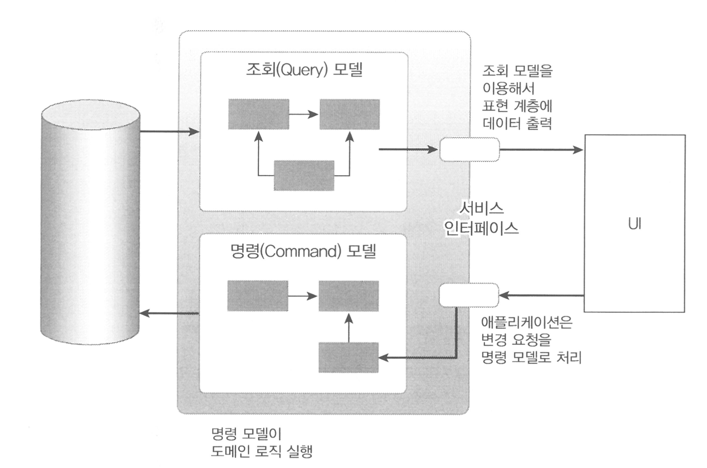

# Chapter 11. CQRS

## 단일 모델의 단점

---

- 조회 화면의 특성상 조회 속도가 빠를수록 좋은데 여러 애그리거트에서 데이터를 가와야 할 경우 구현 방법을 고민해야 한다.
    - ID 를 이용해서 에그리거트를 참조하는 방식을 사용하면 즉시 로딩 방식과 같은 JPA 의 쿼리 관련 최적화 기능을 사용할 수 없다.
    - ID 가 아닌 직접 참조하는 방식으로 연결해도 고민 → 같은 연관도 즉시 로딩이나 지연 로딩으로 처리해야 하기 때문

❗이런 고민이 발생하는 이유는 시스템의 상태를 변경할 때와 조회할 때 단일 도메인 모델을 사용하기 때문이다.

- ORM 기법은 도메인의 상태 변경을 구현하는 데는 적합하지만, 여러 애그리거트에서 데이터를 가져와 출력하는 기능을 구현하기에는 고려할 것들이 많아서 구현을 복잡하게 만드는 원인이 된다.

💡구현 복잡도를 낮추는 간단한 방법: 상태 변경을 위한 모델과 조회를 위한 모델을 분리하는 것

## CQRS

---

- 시스템이 제공하는 기능
    - 상태를 변경하는 기능
        - 도메인 모델 관점에서 상태 변경 기능은 주로 한 애그리거트의 상태를 변경한다.
    - 상태 정보를 조회하는 기능
        - 조회 기능은 한 애그리거트의 데이터를 조회할 수도 있지만 두 개 이상의 애그리거트에서 데이터를 조회할 수도 있다.
    
    👉 범위가 정확하게 일치하지 않기 때문에 단일 모델로 두 종류의 기능을 구현하면 모델이 불필요하게 복잡해진다.
    

- CQRS (Command Query Responsibility Segregation): 상태를 변경하는 명령(Command)을 위한 모델과 상태를 제공하는 조회(Query)를 위한 모델을 분리하는 패턴
    
    
    
    11.2 CQRS 패턴
    

<aside>
💡 CQRS 는 복잡한 도메인에 적합하다.

</aside>

- 도메인이 복잡할수록 명령 기능과 조회 기능이 다루는 데이터 범위에 차이가 발생
    - 단일 모델로 처리하게 되면 조회 기능의 로딩 속도를 위해 모델 구현이 필요 이상으로 복잡해지는 문제가 발생한다.

- CQRS 를 사용하면 각 모델에 맞는 구현 기술을 선택할 수 있다.
    
    
    
    11.3 명령 모델과 조회 모델을 서로 다른 기술을 이용해서 구현할 수 있다.
    
- 명령 모델과 조회 모델의 설계 예
    
    
    
    11.4 명령 모델과 조회 모델 예시
    
    - 상태 변경을 위한 명령 모델: 객체를 기반으로 한 도메인 모델을 이용해서 구현한다.
    - 조회 모델: 필요한 정보를 담고 있는 데이터 타입을 이용한다.
    
    → 명령 모델은 상태를 변경하는 도메인 로직을 수행하는 데 초점을 맞춰 설계했고, 조회 모델은 화면에 보여줄 데이터를 조회하는 데 초점을 맞춰 설계했다.
    

- 명령 모델과 조회 모델이 서로 다른 데이터 저장소를 사용할 수도 있다.
    - 명령 모델은 트랜잭션을 지원해 주는 RDBMS를 사용하고, 조회 모델은 조회 성능이 좋은 메모리 기반 NoSQL 을 사용할 수 있을 것이다.
        
        
        
        11.5 명령 모델과 조회 모델이 서로 다른 DB 를 사용할 수도 있다.
        
    - 두 데이터 저장소 간의 데이터 동기화는 이벤트를 활용해서 처리한다.

### 웹과 CQRS

---

- 일반적인 웹 서비스는 상태를 변경하는 요청보다 상태를 조회하는 요청이 많다.
- 개발팀은 조회 성능을 높이기 위해 다양한 기법을 사용한다.
    - 기본적으로 쿼리 최적화를 해서 쿼리 실행 속도 자체를 높이고, 메모리에 조회 데이터를 캐시해서 응답 속도를 높이기도 한다.
    - 조회 전용 저장소를 따로 사용하기도 한다.
    
    👉 CQRS 를 적용하는 것과 같은 효과****
    

### CQRS 장단점

---

- 장점
    - 명령 모델을 구현할 때 도메인 자체에 집중할 수 있다.
        - 조회 모델을 구분하면 조회 성능을 위한 코드가 명령 모델에 없으므로 도메인 로직을 구현하는 데 집중할 수 있다.
        - 명령 모델에서 조회 관련 로직이 사라져 복잡도를 낮춰준다.
    - 조회 성능을 향상시키는 데 유리하다.
        - 조회 단위로 캐시 기술을 적용할 수 있고, 조회에 특화된 쿼리를 마음대로 사용할 수도 있다.
        - 조회 전용 저장소를 사용하면 조회 처리량을 대폭 늘릴 수도 있다.
        - 조회 전용 모델을 사용하기 때문에 조회 성능을 높이기 위한 코드가 명령 모델에 영향을 주지 않는다.
    
    
    
    11.6 조회 전용 모델을 사용하면 조회 성능을 향상시키는 데 유리하다.
    

- 단점
    - 구현해야 할 코드가 더 많다.
        - 도메인이 복잡하거나 대규모 트래픽이 발생하는 서비스라면 조회 전용 모델을 만드는 것이 향후 유지보수에 유리할 수 있다.
        - 도메인이 단순하거나 트래픽이 많지 않은 서비스라면 조회 전용 모델을 만들 이유가 없다.
    - 더 많은 구현 기술이 필요하다.
        - 명령 모델과 조회 모델을 다른 구현 기술을 사용해서 구현하기도 하고 경우에 따라 다른 저장소를 사용하기도 한다.
        - 데이터 동기화를 위해 메시징 시스템을 도입해야 할 수도 있다.

- 참고
    - [https://github.com/softpeanut/dul-dul-dul/blob/f7bc27db77475e62a27e1ff6d7f5ffb3eb4918c2/도메인 주도 개발 시작하기/Chapter11. CQRS/02. CQRS.md](https://github.com/softpeanut/dul-dul-dul/blob/f7bc27db77475e62a27e1ff6d7f5ffb3eb4918c2/%EB%8F%84%EB%A9%94%EC%9D%B8%20%EC%A3%BC%EB%8F%84%20%EA%B0%9C%EB%B0%9C%20%EC%8B%9C%EC%9E%91%ED%95%98%EA%B8%B0/Chapter11.%20CQRS/02.%20CQRS.md)
